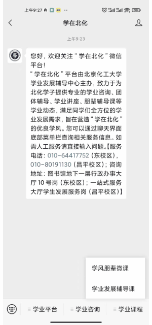

学习，是同学们大学四年最为重要的一项任务，但是大家初入校园，很多同学对自己未来的学习生活都充满了迷茫，不知道该怎么迎接未来四年的大学生活。

这个时候，一项符合大家自身需求的学业发展规划就显得尤为重要了。好的学业规划，可以为我们将来的学习生活打下坚实的基础，为我们毕业后的发展找好定位，是同学们在初入大学时的神兵利器。但是肯定也有同学会问，我对大学一点也不了解，怎么做规划呢？

其实是有办法的，我们可以求助学校学工办的学业发展辅导中心。学业发展辅导中心是学校专门建立起来为同学们学习发展服务的，能满足同学们全方位的学业发展需求。

我们可以通过多种渠道，来向学业发展辅导中心求助。

## 昌平校区一站式服务大厅1号窗口——学生发展服务岗

预约方式：

* 在线预约服务：[学业发展咨询在线预约服务](https://www.wjx.top/m/72413713.aspx)

* 电话预约：010-80191130（工作时间）

申请材料：《北京化工大学学业发展咨询预约登记表》，现场领取。

服务流程:

>① 填写《北京化工大学学业发展咨询预约登记表》；  
 ② 岗位建档，领取《北京化工大学学业咨询学生档案》，与相关咨询师取得联系，确认双方咨询时间和地点，提前10分钟到达指定地点；  
 ③ 咨询过程，咨询师完善《北京化工大学学业咨询学生档案》；  
 ④ 咨询结束，回到岗位，归还《北京化工大学学业咨询学生档案》，填写《预约情况反馈表》。

 ## “学在北化”微信公众号

 “学在北化”平台由北京化工大学学业发展辅导中心主办，致力于为北化学子提供专业的学业咨询、团体辅导、学业讲座、朋辈辅导课等学业动态，满足同学们全方位的学业发展需求，旨在营造“学在北化”的优良学风。同学们可以通过聊天界面下的底部菜单栏，来查询各种和学习相关的服务信息。

 
