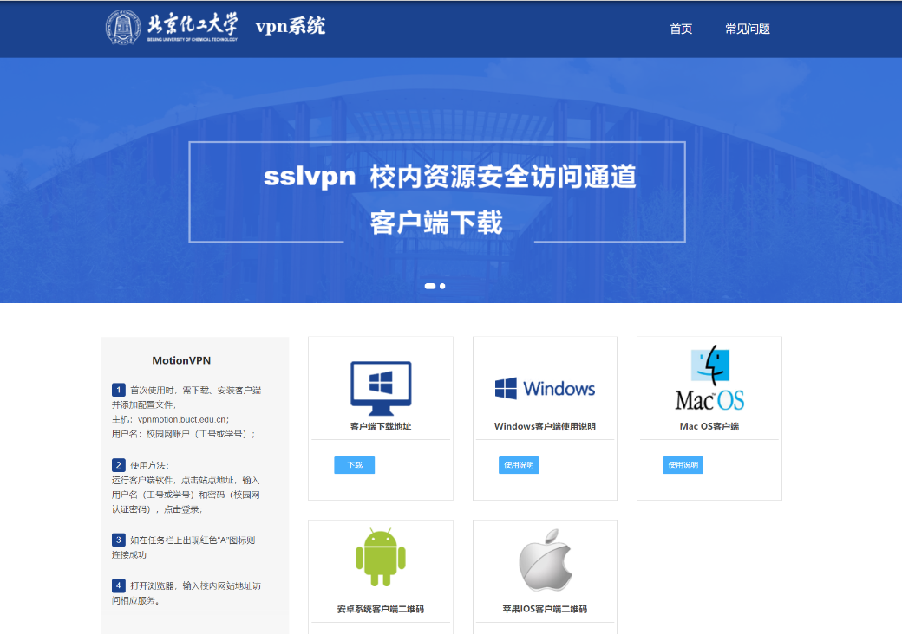
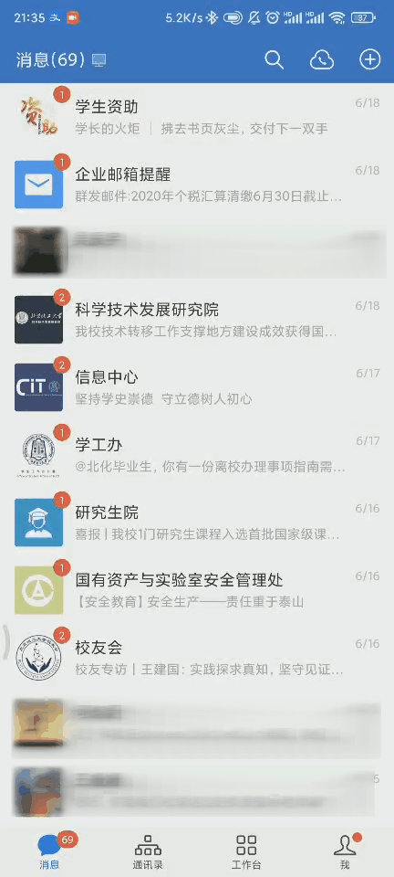

## 连接校园网方式
有线：宿舍、教学楼内均提供千兆网线端口，可以使用符合RJ45标准的网线进行连接，通过墙上的网口连接后即可访问校园网进行登录操作。  

无线：北化昌平校区基本实现WIFI全覆盖，可以通过BUCT、BUCT-JX等WIFI进行连接；东区除宿舍外，WIFI基本全覆盖。
## 校园网常用网址

校园网登陆页面：[https://tree.buct.edu.cn](https://tree.buct.edu.cn)。  

校园网自服务平台：[tree.buct.edu.cn:8800](tree.buct.edu.cn:8800)。

校园网登录IP地址：[202.4.130.82](202.4.130.82)、[202.4.130.95](202.4.130.95)

（当通过域名无法访问时，可以尝试以上两个IP地址）。

## 校园网账号密码（链接一站式服务大厅密码重置）

校园网账号为自己的学号，初始密码为登录[数字门户](my.buct.edu.cn)的密码（默认为8位生日的年月日），如忘记密码，可以前往图书馆一楼服务大厅20号窗口信息中心服务岗进行重置，或者通过数字门户网站进行重置，或访问[https://uc.buct.edu.cn/#/reset/index](https://uc.buct.edu.cn/#/reset/index)进行重置。
 
## 校园网VPN
### PC端  

因为有一些校内资源只允许内网访问，或者下载一些文献时需要通过学校IP才能免费下载，如果我们又恰好不在学校，这个时候就需要利用学校提供的VPN服务，进行远程连接。可以通过[https://vpn.buct.edu.cn/](https://vpn.buct.edu.cn/)进行VPN软件的下载和使用教程查看。  

①	在浏览器中访问[https://vpn.buct.edu.cn](https://vpn.buct.edu.cn/)；  
②	根据自己的电脑平台下载对应的软件；  
③	根据网页提示，安装配置软件。  

### Web VPN门户
Web VPN门户是为了方便师生不在学校或者无法连接校园网时，登录学校一些服务网站和文献资源网站。通过登录[WebVPN门户](https://w.buct.edu.cn/login)，即可登录校内其他网站。  

## 校园网套餐说明
一、学校东校区主教学楼、东校区科技大厦东配楼教室、东校区图书馆、西校区教学楼、昌平校区教学楼、昌平校区图书馆区域，通过BUCT-JX无线网络实名认证上网，流量不计费。 

二、学生套餐每月免费10GB，超出10GB后1元/1GB，超出20GB后2元/GB，超出90元不计费。  

三、教职工套餐每月20G，超出1元/GB，超出90元后不计费。

## 常见Wi-Fi说明
BUCT：主要的无线网WIFI，使用时会进行计费。

BUCT-JX：主要服务教学使用的校内无线网WIFI，需要登录使用，使用时不进行计费。  

BUCT-LIB：图书馆设备专用网络，无法访问外网，除图书馆专业人员外，不建议连接。

BUCT-JF：机房无线网，仅供机房电脑上网使用。  

## 缴费说明
网费缴纳分为两步，首先是将钱充值进电子钱包，然后进入校园网自助服务平台将电子钱包里的钱对使用的网费套餐进行充值。
  
电子钱包充值步骤：   
①	打开企业微信（微信、企业微信APP均可）；  
②	打开“校园卡服务”应用；  
③	选择“校园卡服务”中的“校园卡”，即可看见电子校园卡；  
④	选择“网费充值”，并输入充值金额；  
⑤	选择校园卡支付或者微信支付，完成支付后即可（注：充值系统开放时间为5:00-23:00）。

网费套餐充值：  

①登录[自助服务平台](http://tree.buct.edu.cn:8800/)，此时可以看到电子钱包里有已充值的钱；  
②点击“产品充值”，进入充值页面，并输入充值金额后点击“提交”，即可充值完成。  

## 移动端使用说明  

①	手机连接上可用的校园网WIFI后，稍等片刻，手机会弹出登陆提示；  

②	点击此提示，会跳转到校园网登陆界面；  

③	输入账号密码正常登录即可上网。

## 常见问题及解决方案  

 

### 登录时弹出“无感知用户请到自服务解绑绑定再点击下线”。   

  

解决方法：这种情况下，刷新页面，输入账号密码后，点击自助服务，然后关闭无感知认证。  
 
关闭自服务后，下线其他设备，然后刷新登陆页面重新登录即可。  

### 提示“找不到计费策略”。  

解决方法：请进入自助服务页面检查是否欠费，如欠费则缴纳网费后即可正常使用，如未欠费，请前往图书馆一站式服务大厅20号窗口信息中心业务咨询岗进行查看。  

### 连接上BUCT或BUCT-JX后登录，但却无法访问外网。  

解决方法：这可能是因为当前连接WIFI人数过多，设备压力大造成，可以选择等待一会，或者选择另一个WIFI进行登录尝试。                    

