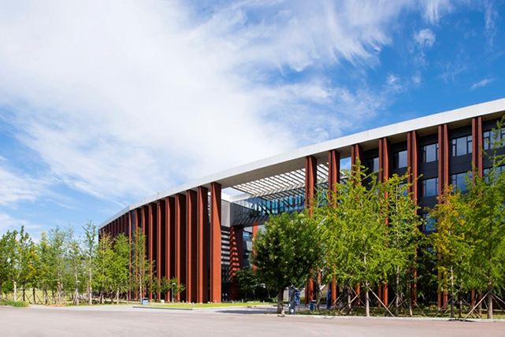
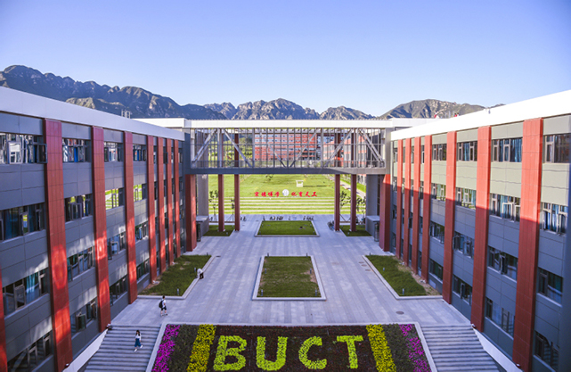
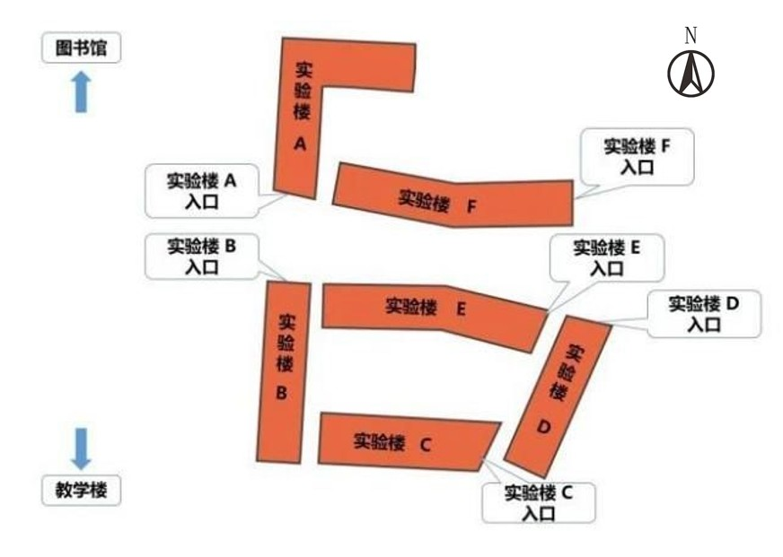
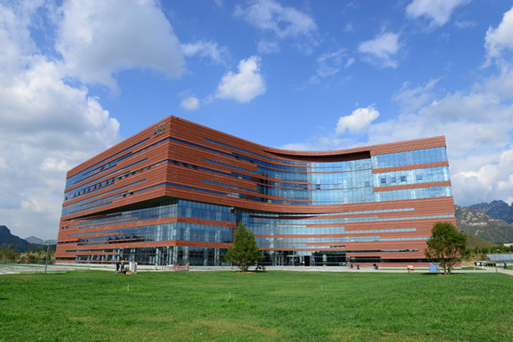
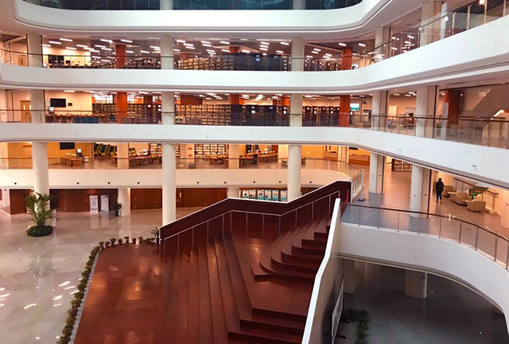
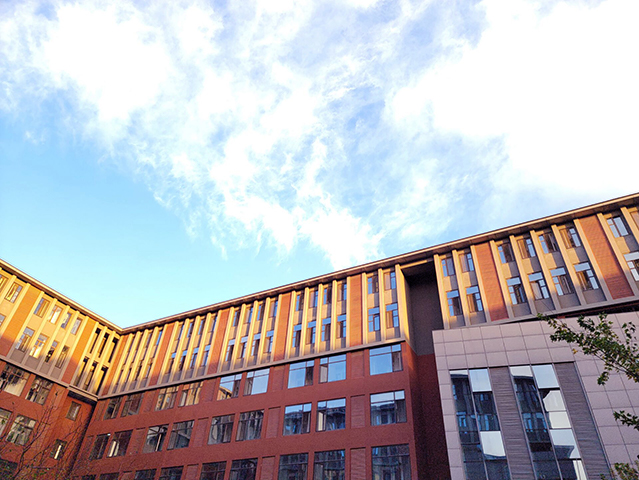
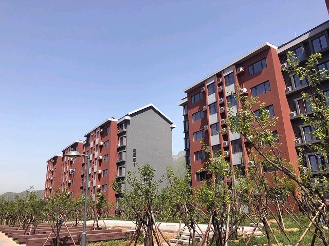
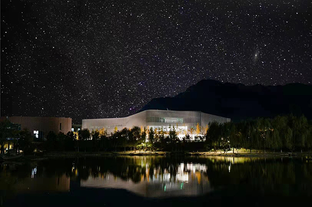

走入南涧路29号，首先映入眼帘的是与校园环境相映衬的校园建筑，在外观上，建筑的设计感与现代感并存，细节之处融入着北化特色；在内部使用上，建筑内设施一应俱全，室内设计人性化。昌平校区已经建成的体育馆、第一教学楼、实验楼、图书馆、工程训练中心、紫竹餐厅、后勤楼、宿舍楼和大学生活动中心在建筑位置和建筑外观上，都具有独特的设计巧思。

## 体育馆

体育馆位于学校南门北侧，场内空间开阔，足够进行教学、锻炼和娱乐活动，一些体育比赛和大型会议都会在馆内进行。

## 第一教学楼

第一教学楼正对着主校门，A楼与B楼为对称设计，玻璃连廊贯通A、B两楼，缩短了学生课间转换教室的时间。落地窗式设计使师生能更好地欣赏楼外美景，同时也使建筑在不同角度呈现出不同色调。

## 实验楼

实验楼在第一教学楼和图书馆之间，已经建成的六栋楼各有功能，来上课时不要走错。

## 图书馆

从图书馆正前方望去，建筑与群山相辅相成，给人视觉上的美感；图书馆旁是静谧的柳湖，学习效率不高时，也可以来柳湖欣赏美景，放松心情。图书馆内的共享中庭设计感爆棚，室内采光也为学生学习带来了更多舒适感。

## 工程训练中心

工程训练中心位于图书馆北，有些课程会在这里进行。运气好的话，还可能会偶遇猫咪。

## 紫竹餐厅

紫竹餐厅位于樱花苑北，有多个入口，有效地避免了就餐时间餐厅拥堵的情况发生。

## 后勤楼

后勤楼是校医院的所在处，距离樱花苑很近，学生就医十分方便。北区的主要行政办公室除了图书馆五层的学院办公室外，其余都在后勤楼，还有一些社团办公室也藏在楼内。

## 宿舍楼

### 樱花苑

樱花苑，顾名思义，其附近种有樱花，每年3-4月花开时节，很容易看到南口的风带来的花瓣雨。

### 杏坛苑

杏坛苑位置偏远，在玉屏山下，教职工公寓和留学生公寓在那里。

## 大学生活动中心

最新刚刚建成的大学生活动中心是北化最具现代感的建筑之一，建筑外立面设计独特，在不同视角、不同光线下，给人带来不同的视觉感受。

**引用：**

[北区办](https://open.work.weixin.qq.com/wwopen/mpnews?mixuin=1Ko2BwAABwBjTc2fAAAUAA&mfid=WW0315-lfRRNQAABwB1mAQebRrcQQ7KCZc4c&idx=0&sn=27f085e2c64feafb373751742ab82f23)

[新校区建设指挥部](https://open.work.weixin.qq.com/wwopen/mpnews?mixuin=1Ko2BwAABwBbBQVxAAAUAA&mfid=WW0301-CPmxtgAABwDoleSdnMSb-Axf6v_5b&idx=0&sn=0d395501fe70b4499eeb8dfbc4173d89)

