在北化，你可以看到各种各样的风景！

远离了喧嚣浮华的市区，看不到星罗棋布的楼宇；无论是白昼，还是傍晚，亦或者是黑夜，你都可以拥有不同的北化限定风景。

## 白昼

在去第一教学楼上课的路上，在去体育馆锻炼的途中，在去图书馆自习的过程中，你有没有留意过校园内的美景——蔚蓝的天空和特别的云朵，洒满阳光光的小路和草坪……

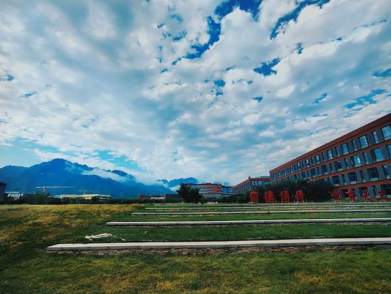

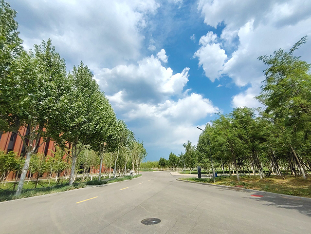

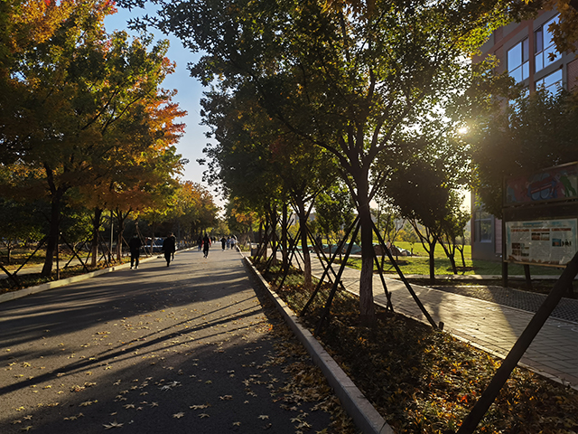

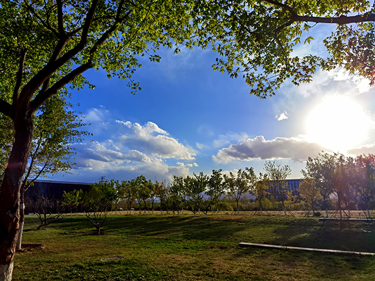

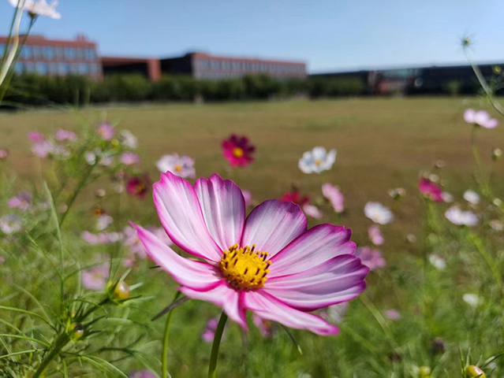

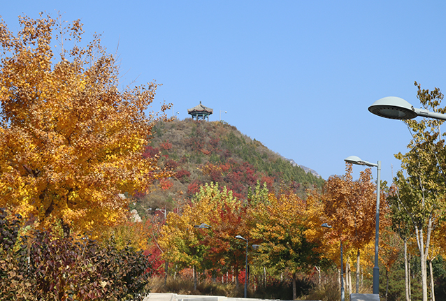

## 傍晚

这里，温柔的晚霞可能在某一天猝不及防地出现，没有高楼大厦的阻挡，你可以从各个方位欣赏北化的专属晚霞。在晚霞的映衬下，傍晚的校园拥有着滤镜般的色彩。

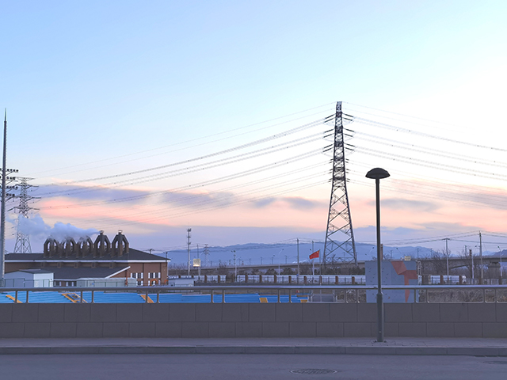

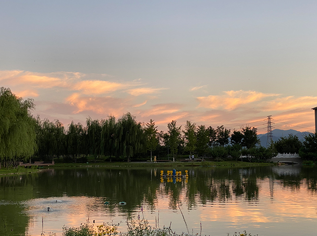

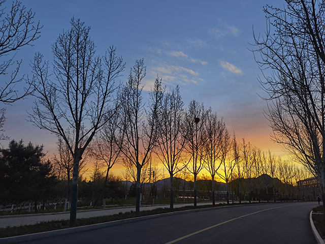

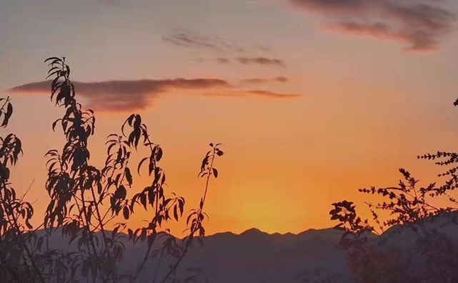

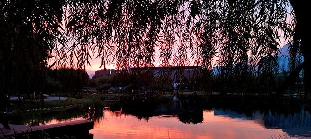

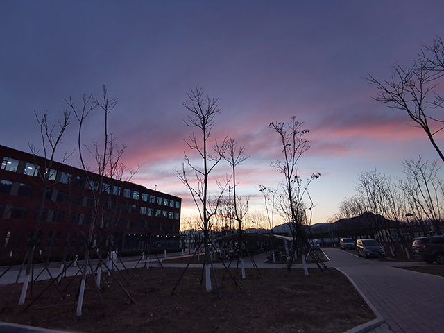

## 黑夜

在校园不同位置看，北化的夜晚也是不同的。教学楼和图书馆的灯会亮到很晚，因为总有人在通往梦想的路上拼搏；风雨操场的灯光下会有人跑步、踢球、唱歌或者团建；校园小路上，有人在散步谈心。

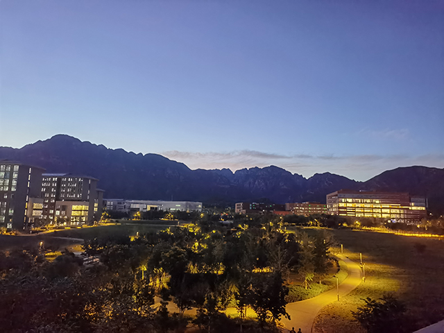

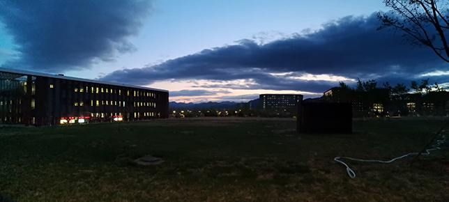

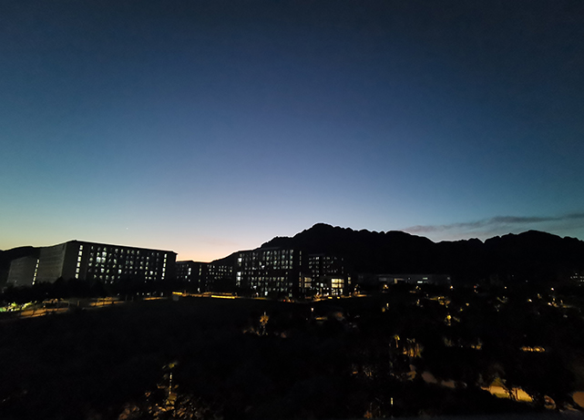

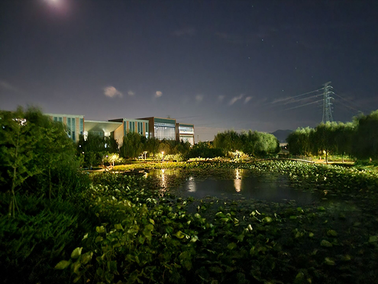

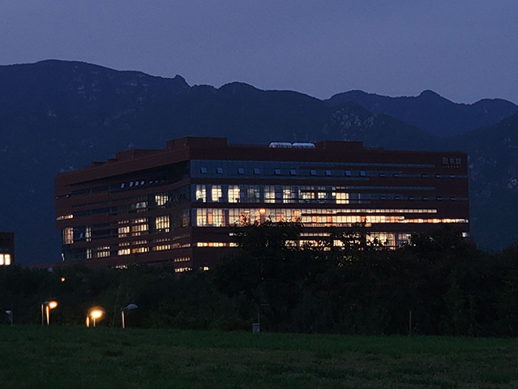

这里是南涧路29号，在这里的每一天都会很特别！

