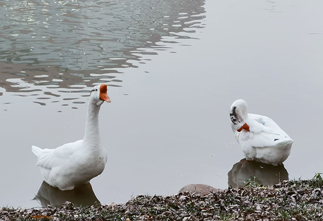
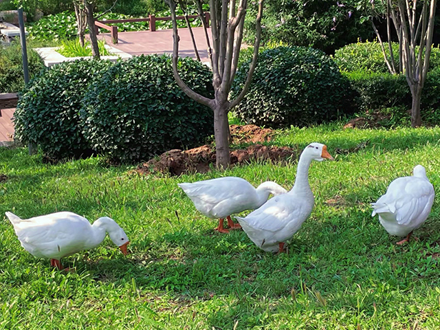
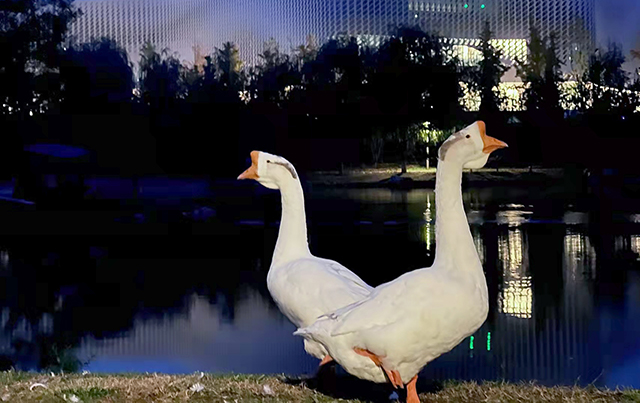
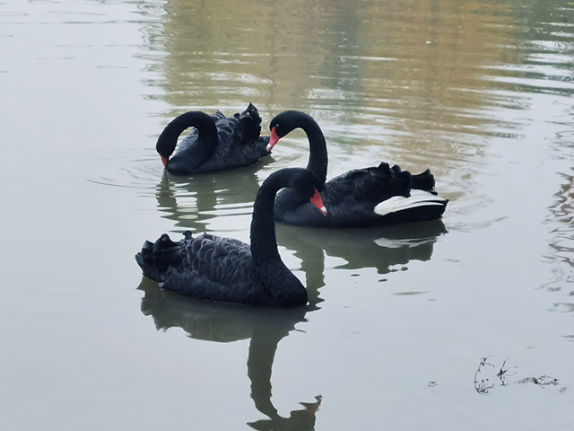
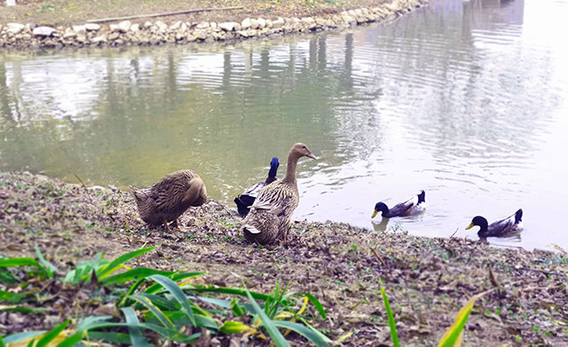
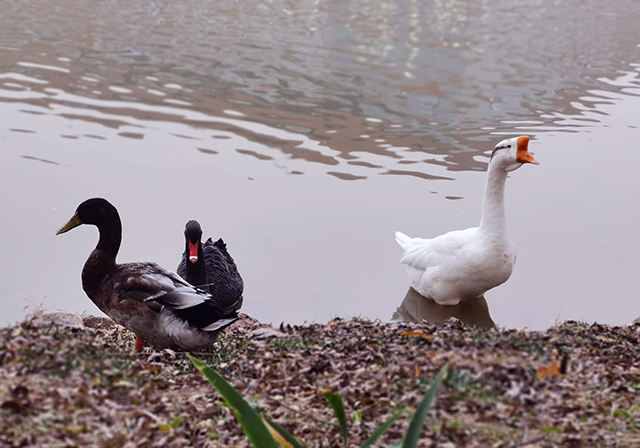
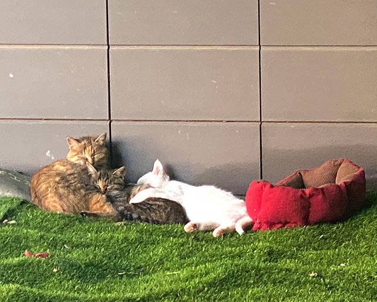
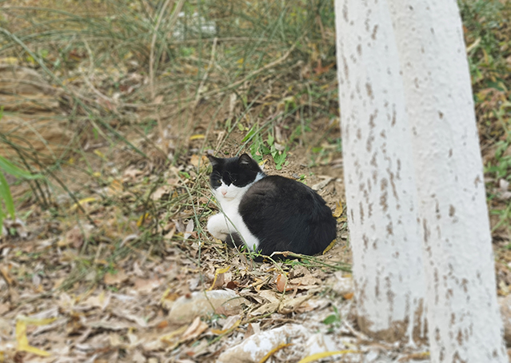
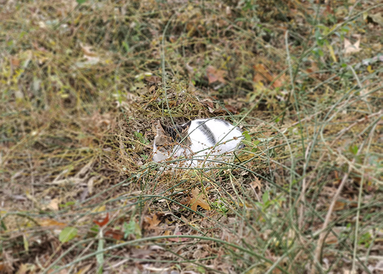
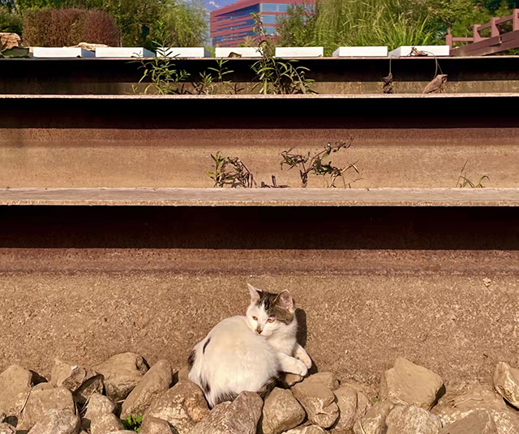

在北化校园里，不仅有在知识海洋里遨游的学子、兢兢业业传道授业的老师，还有分布在校园各个角落憨态可掬的校宠——南涧路29号的动物居民。

## 摇头摆尾的大鹅

柳湖中、宏德大道上、教学楼门前……在这些地方，你都可能看到结伴而行的大鹅大摇大摆地走过。也许在某次匆匆赶去上课的路上，大鹅恰好与你同行。

## 娴静优雅的黑天鹅

与日常在校园里闲逛的大鹅不同，黑天鹅常驻柳湖。在紫竹餐厅到图书馆的路上，姿态优雅的黑天鹅总能吸引你的注意力。白昼里，它们是图书馆旁优秀的卫士；黑夜里，他们是柳湖面上高贵的舞者。

## 默默无闻的野鸭

同样在柳湖常驻，野鸭会更加低调一点，它们在柳湖中徘徊觅食，也会同黑天鹅和大鹅一起浮水。

## 行踪不定的猫咪

在校园里遇到猫咪要靠“缘分”，有些猫咪会在主教附近活动，有些猫咪会在工训中心活动，也有些猫咪可能会出现在校内的任何角落。校园里有人为猫咪们安置了猫窝和放猫粮的碗，也有人为猫咪们张贴了投喂小贴士。虽然猫咪很可爱，但是大家投喂时要谨慎，有些猫咪胆小护食，所以一定要保护好自己手，避免被抓伤。

在课间去超市的路上，你可能会偶遇相拥而眠的小白、短尾和小狸花。

在校园中闲逛时，你也可能会碰到聪明高冷小黑，躲在草丛中酣然入梦的中分无花臂和晒太阳的中分花臂。

大鹅、黑天鹅、野鸭、猫咪，它们都是我们在忙碌的学习生活中的奇遇，陪伴我们走过许多个日日夜夜，它们是专属于北化人的小美好。

我们同为南涧路29号的居民，也请大家善待它们！

**引用：**

[北京化工大学公众号](https://mp.weixin.qq.com/s/TpsY58ayw-ZvXHRQzMWYeg)

[北京化工大学公众号](https://mp.weixin.qq.com/s/Egnxpjs1M5rIEFRBs9NHlw)

