简介：

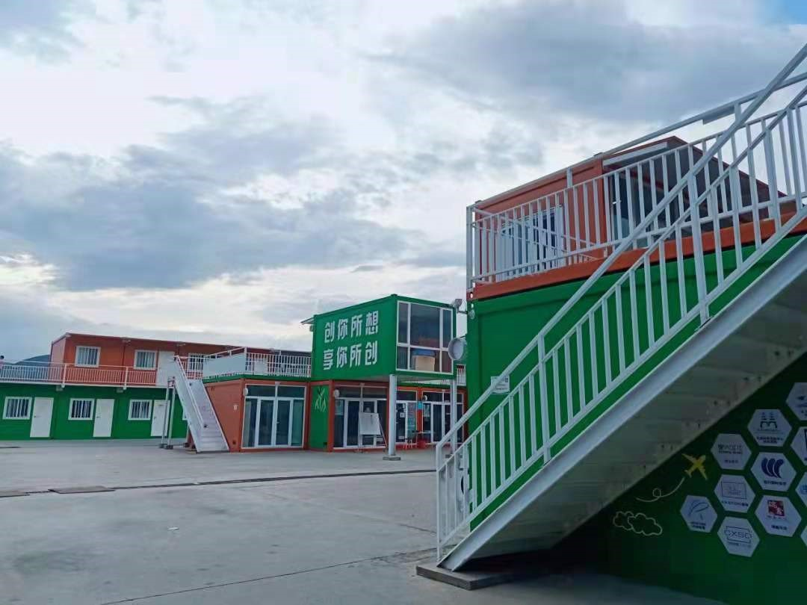

创享商圈，北化创客新天地。

创，即为创想，创造。在国家提倡双创大背景下，支持鼓励更多大学生参与到创新创业实践中以创新创业人才培养为终极目标。

享，即为分享，悦享。

北京化工大学创新创业实训基地-创享商圈，以北化创享创造美好校园生活为设计理念，选拔以创新为基础开展创业、用不断优化的产品和服务为全校师生提高生活质量的项目入驻，并面向全校开放校内勤工助学岗位。旨在解决创新创业教育实践中大学生创业者“缺乏经验”的痛点，为学生提供创业实践的平台，让创新创业服务校园生活，使全校共同分享学生创新创业成果的同时，为学生日后开展本专业创业、提高创业成功率打下坚实的基础。创你所想，享你所创。创你所想，喜你所创。

地址：昌平校区西侧，紫竹餐厅旁。

## 刀笔贾竖自媒体文创工作室

地址：创享商圈102

介绍：作为一个互联网+文创设计+自媒体运营的工作室，他们为学生先进思想发声，立志做北化学生对外的窗口，占领舆论阵地宣传北化校风。目前其公众号文章篇均阅读量6k，最高阅读量3w，是北化阅读量最高，最具影响力的自媒体之一。
秉承严格审核商业性行为及广告内容准则，做正向传导，正能量输出，做最有创造力，最有趣的校园自媒体平台。

## 胜利之战

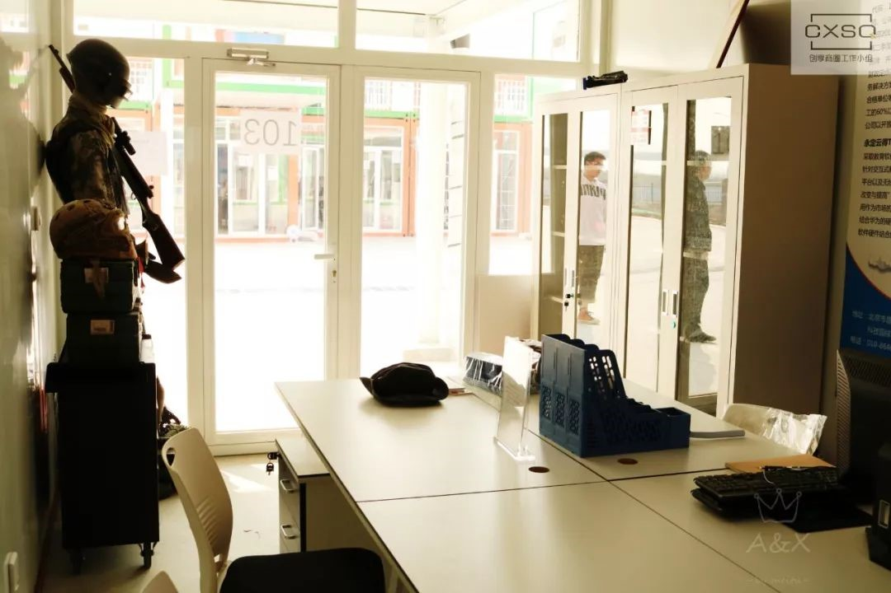

地址：创享商圈103

介绍：胜利之战的创客最初是受到军训时的水弹比赛影响，觉得当代青年，骨子里都有一股热血，会比较想体验射击，实战的感觉，所以就想在学校也创建一个水弹射击的场所，提供真人CS服务。

## 遇见花坊

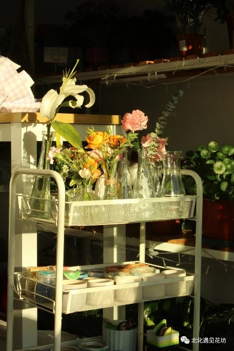

地址：创享商圈105 

介绍：工科的氛围之中需要一点文艺的气息，这不，在商圈你就能遇见花坊。听说除了卖花，这家店铺还会开设插花，陶艺体验等课程，为校园增添一丝文艺气息。为了贴合北化特色，他们还打算推出试管绿萝等一批有意思的小植物等着同学们去探索。主营业务包括鲜花绿植，多肉干花，花礼定制，团购礼品等。店铺内设有花草陈列区、客户自由拍照区、等候休息区、员工工作区。

营业时间：

工作日：10:00—12:00，14:00—17:00，18:00—21:00

双休日：11:00—13:00，16:00—21:00

客服在线：9：00—21：00

## 荣耀造型

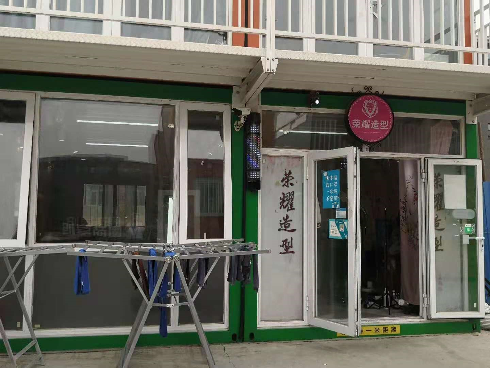

地址：创享商圈109

营业范围：剪、烫、染、护理。

收费标准：

>剪发：男士20元/次，女士25元/次  
烫发：短发128元/次，长发168元/次  
染发：短发118元/次，长发158元/次
营养液：68元/次  
剪发会员卡：男士150元/10次，女士200元/10次。会员卡可以长期多人使用。  

## 明璇美发美甲

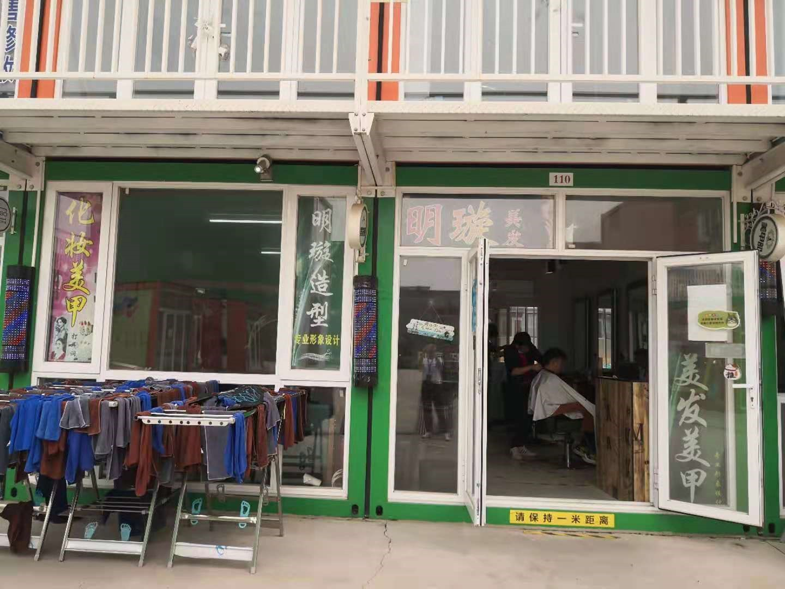

地址：创享商圈110

营业范围：剪、烫、染、护理。

收费标准：

>剪发：男士20元/次，女士25元/次  
烫发：短发128元/次，长发168元/次  
染发：短发118元/次，长发158元/次  
营养液：68元/次  
剪发会员卡：男士150元/10次，女士200元/10次  
纯色美甲：58元/次  
充值会员卡：充值300元享烫染8.5折；充值500元享烫染8折；充值1000元享烫染 7.5折；充值2000元享烫染 6.7折。  
持会员卡剪发：男士：15元/次，女士：20元/次。会员卡可长期多人使用。  

## 北化小铁馆 

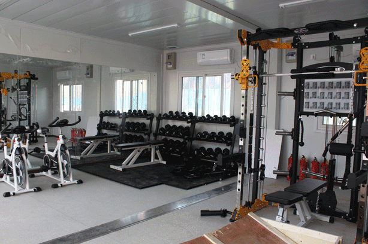

地址：创享商圈112  

介绍：为响应全民健身的号召，化工肌细胞&轻力体型工作室提供全面的运动器材，还有诱人的胶囊健身房，满足你的私人健身需求！此外他们还会邀请专业健身人士传授一些健身知识技巧和健康常识，并指导大家锻炼，他们喊出口号：只要大家想健身了他们就会一直在！

收费标准：年卡799元，期卡300元。

营业时间：9：00—22：00 

## 新干线维修

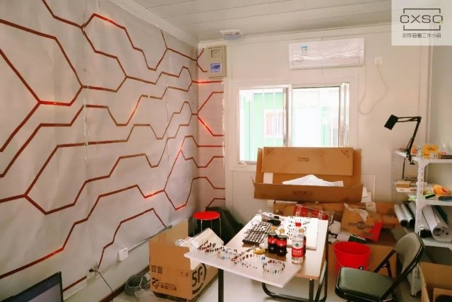

地址：创享商圈116

介绍：从帮人修电脑换取小礼品到组建一个强大的修理团队，这位新干线团队创客给我们留下了很深的印象。“修电脑的经历不计其数，宿舍都堆满了零食。我的老客户都向别人推荐我。”有相比市面更低的价格和同学们之中的好口碑，使得他迈出了创业这一步。电脑维修、升级、清灰、组装、回收，只要和电脑相关，这里一应俱全。

营业时间：12：00—20：30

## 北化科技产品体验店

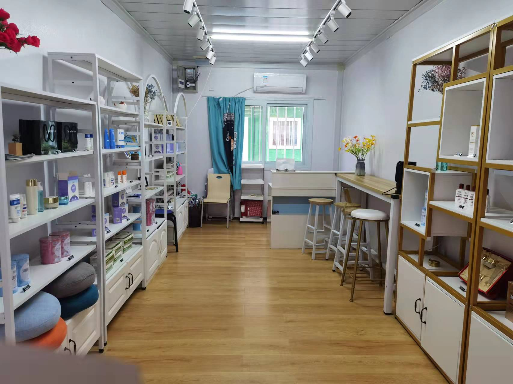

地址：创享商圈117

经营范围：学校自主研发的华教授化妆品、杰瑞婷保健品的售卖。

## 北极星摄影

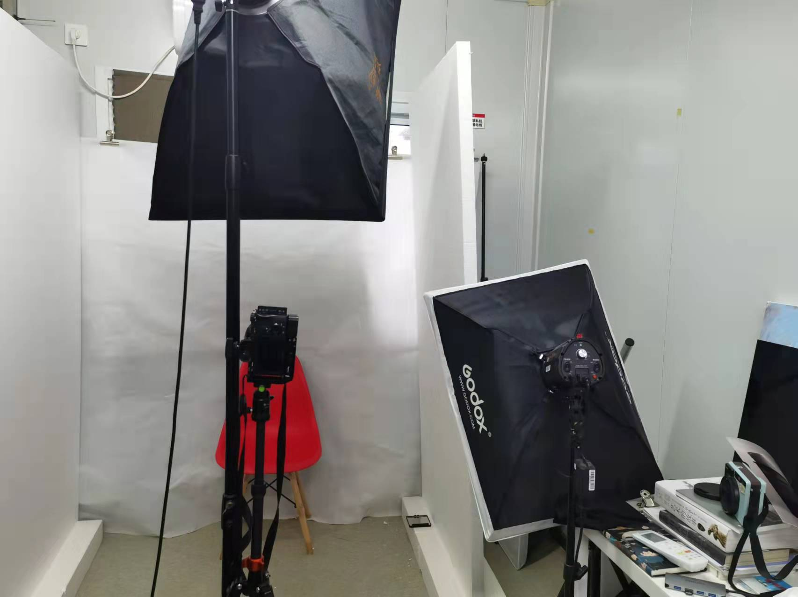

地址：创享商圈204

收费标准：

>基础美化证件照（附赠4张2寸照片或9张一寸照片）：29元 
     加急当天出图证件照：49元
     换正装、换发型：10元
     照片、证件照打印：5元/张

营业时间：10：00—22：00

## REBORN球鞋诊所

地址：创享商圈205

营业范围：球鞋的洗护、维修，球鞋回收转卖。

营业时间：12：00—23:00

## 中国移动

地址：创享商圈206

营业范围：中国移动各类业务，手机维修，手机贴膜，手机配件零售。

营业时间：9：00—21：00

## Momo的画室

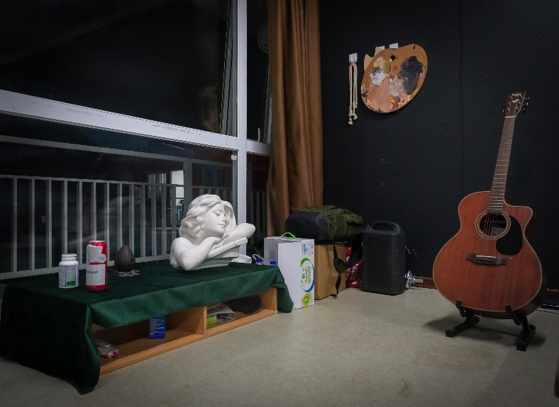

地址：创享商圈208

介绍：“Momo的画室”是一家文化创意服务类的教学培训机构，面向北京化工大学校区内所有常规人员招生，主要针对的客户群体是在南口校区对美术和艺术创作感兴趣的学生或校内公职人员，为其提供美术培训指导。

营业范围：

提供素描，速写，色彩，油画等美术基础指导，绘画创意题材设计，装饰画艺术设计指导，校内外景物写生活动，假期国外艺术交流访学。

收费标准：

>绘画空间使用：10元/半天，17元/天。  
    DIY手做活动：根据成本议价。  
    绘画兴趣班：500元/学期/人。  
    创意艺术品制作活动(装饰画，艺术logo，艺术字设计)40元/人/次；3人团90元/次 (需提前预约)。  
    学生可在学期内任何空闲时间至画室进行绘画习作，学费可在学期末交纳。  

## 千风桌游

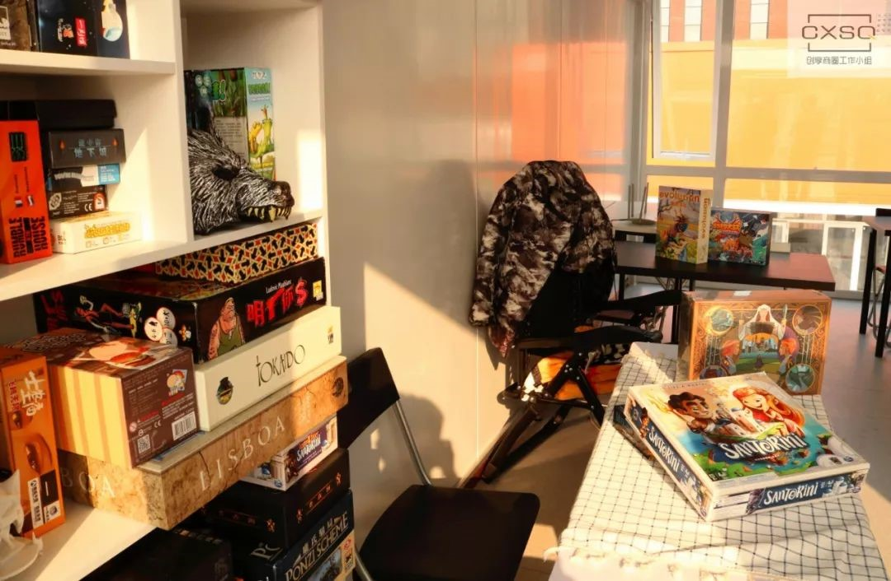

地址：创享商圈210

介绍：千风桌游的老板希望能给同学们一个近在咫尺的娱乐交友平台——让大家足不出校，就能享受到桌游吧的体验。他们提供的游戏种类广泛，不仅有常见的桌游，更有很多原版的进口游戏，后续还会给大家组织剧本预约活动，而且所有游戏都有专人教学噢，可以让大家安心享受学习后的放松时刻。

营业时间：13：00—22：00

## 燥乐工作室

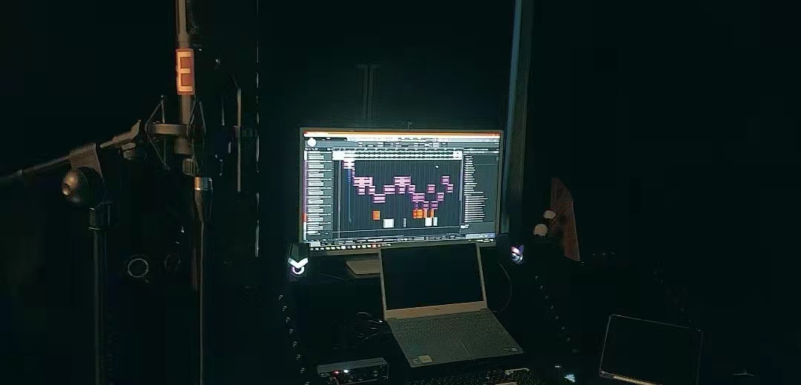

地址：创享商圈211

介绍：燥乐工作室主营个人单次录音、混音·母带及后期处理、团体单次录音、HIP-POP及流行BEAT制作、现场表演垫音·和声·伴奏处理服务，兼营音响租借以及相应道具租赁服务，同时他们也为说唱爱好者提供了一个聚集空间。

营业时间：8：00-20：00
