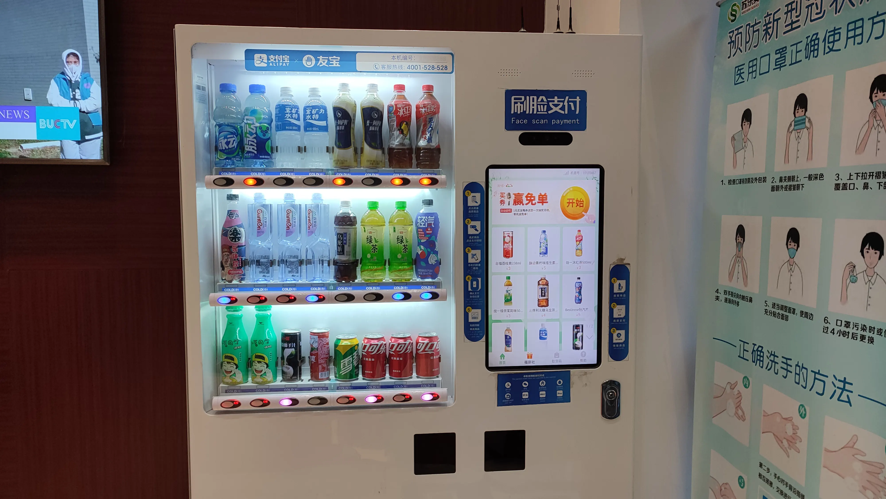
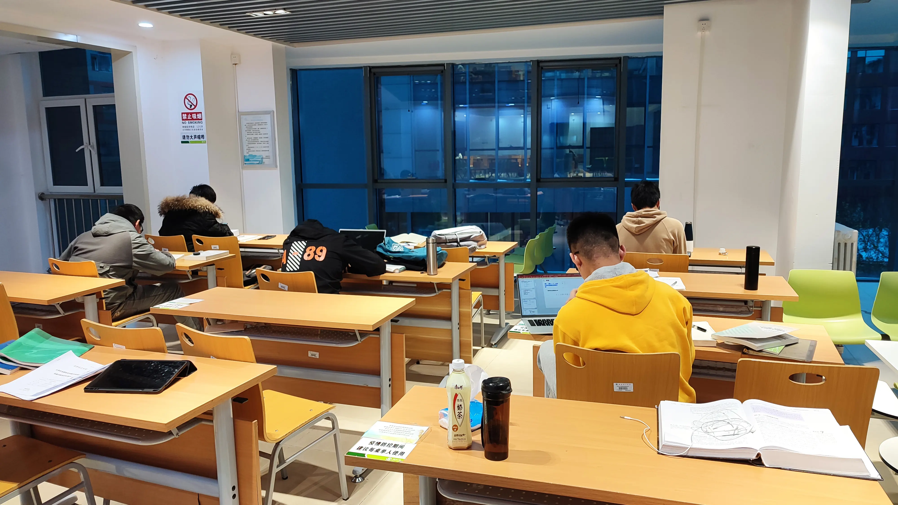
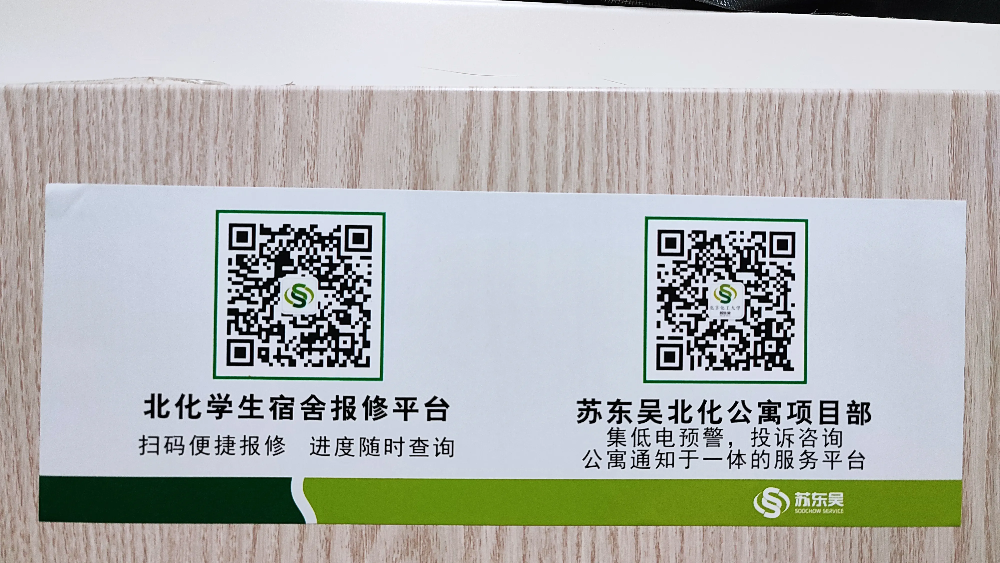
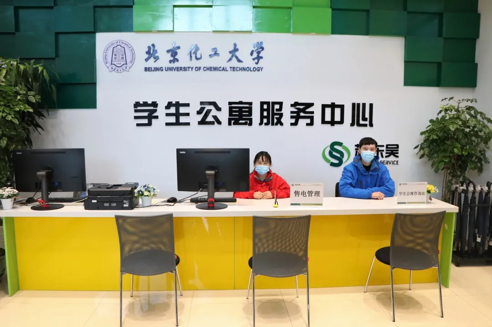
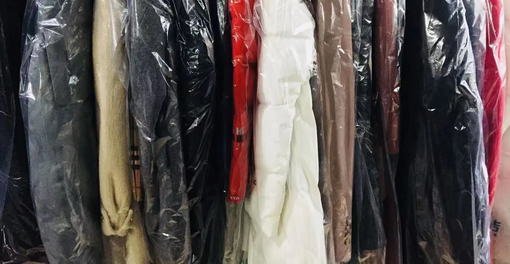
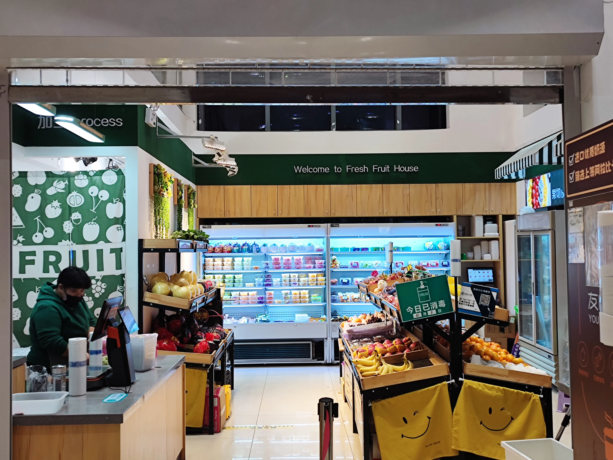

## 宿舍楼简介

宿舍是同学们每天生活中接触最多的楼宇，应该也是大家在北化的四年中感情最深的建筑。今天，我就带大家深入了解一下我们平时生活的宿舍，看看是否有什么我们没有注意到的便利服务。

北区宿舍楼的开放时间为每天的6:00-23:00，如果同学们在这个时间段以外进出宿舍，需要刷卡，虽然不太方便，但也是为了同学们的安全和健康着想，希望同学们都能早点休息。

## 会客厅

宿舍里的会客厅在同学们的日常工作、学习、生活里发挥着非常重要的作用，承担着会客、小型会议场合、学习场合等多个作用。

在会客厅里，有几排面对面的桌椅，我们能在这里进行办公学习。尤其是当大家组队参加了比赛需要进行面对面的交流时，会客厅就是一个绝佳的会议地点，完全可以支持小组队员进行比赛交流。

会客厅除了作为会客、开小型会议的场所，它也发挥着其他的作用。

每一座学生公寓楼里，北化勤工助学中心都设置有“闲来书屋”，书架上的书就是勤工助学中心提供的。书架上整齐排列的书籍，涵盖了高等数学资料书、大学英语四六级资料、经济管理书籍、世界名作，娱乐书刊，时装刊等，同学们可以免费借阅，但是别忘了在借阅时扫描上边的二维码进行信息登记哦。

从书架上我们也可以看到一些包装袋，牛奶盒等，这些物品是同学们临时储存在这里的。如果有需要，同学们可以暂时将一些私人物品放置在会客厅，但是因为会客厅属于公共空间，所以超过一定的时间、宿管阿姨会收走，所以同学们记得及时取走自己的私人物品，并且不要把贵重物品储存于此，避免丢失。

## 咖啡机与自助售水机

从会客厅出来，我们可以看到一个咖啡机与饮水机，同学们可以随时的到这来购买你想喝的牛奶饮料。（ 在南北两侧都有自助售水机哦。）

## 盥洗室

在宿舍楼的每一个楼层里都会有四个盥洗室，其中会有两个盥洗室面积较大，并且还有两个洗衣机，另外的两个盥洗间面积相对较小。阿姨每天上午和下午都会对盥洗室进行打扫清洁，让我们的盥洗间一直都保持干净整洁。

## 浴室

浴室的开放时间是中午12:00-晚上23:00。在开放时间内，同学们只要插上自己校园卡就可以进行淋浴。每个浴室都有六到七个位置，如果没有特殊的情况，完全能满足同学们的使用。同时，保洁阿姨也会对浴室进行清洁消毒，同学们可以放心使用。

在浴室里面还有一个巨大的衣物临时存储柜，同学们洗澡时可以把自己的衣物放置在里面。如果有遗漏得物品没能及时拿走，保洁阿姨会将该物品移至右下角的柜子里，直到当周的周天，如果一周内物品没有人认领，阿姨会把物品进行清理，所以同学们记得在洗完澡后及时拿走个人物品。

## 开水机

在宿舍的每一层楼里都会有两个开水机，开水机24个小时一直都会提供100度的热水，同学们可以自备热水壶进行打水。

## 自习室  

自习室是同学们在宿舍楼里进行学习的一个非常重要的场所。每一栋学生公寓的三层与四层都会设置，桌椅齐全，大约可以容纳30个同学一起学习，并且宿舍自习室24小时都不熄灯，如果同学们不想出宿舍大门，又想去一个和图书馆一样能安静学习的场所，那么宿舍自习室就是一个很不错的选择。

## 休闲区

除了第一层以外，每一层学生宿舍都会设置有休闲区，如果休闲区恰好处于一个比较好的角度，那么休闲区窗外我们就能看到美丽的校园风景。在宿舍待久了同学们可以到休闲区欣赏一下窗外美丽的校园风景。

## 宿舍报修

平时大家的宿舍里可能会有一些物品损坏，比如灯泡、空调、门等，这时我们可以扫描宿舍门后的二维码。按照如下图所示进行操作进行宿舍物品报修，苏东吴学生服务中心很快就会前往处理。同学们记得检查信息是否填写错误哦！

## 三号楼学生公寓服务中心

*注：图片来源于北京化工大学学生权益部*

*注：图片来源于北京化工大学学生权益部*

*注：图片来源于北京化工大学学生权益部*

*注：图片来源于北京化工大学学生权益部*

*注：图片来源于北京化工大学学生权益部*

*注：图片来源于北京化工大学学生权益部*

同学们在宿舍生活中可能会遇到宿舍楼公共设施损坏的问题，这时，我们可以找学生公寓服务中心来解决。

学生公寓服务中心里阿姨心灵手巧，能免费帮助同学们缝补衣物；平时大家的自行车坏了也可以借用这里的工具箱，对自行车进行维修；宿舍要是断电了，我们也可以到这里进行咨询用电情况。

学生公寓服务中心位于学生公寓3号楼，开放时间是每天的10:00-21:00，同学们可以在工作时间内到这里咨询你想要的服务。

## 干洗店

上了大学，许多同学用到西装，可是我们不会洗怎么办？平时鞋子太多，脏了又不想洗怎么办？这时，一个洗衣店对于同学们来说就很有必要了。该洗衣店设置在校外，平时同学们如果想要清洗衣物鞋子被子等，只需要添加微信：beihuaganxidian6688，联系阿姨，阿姨便会骑着小电驴在你空闲的时间来取你的衣服。清洗的时间大概是三天左右，洗好的衣物鞋子非常干净，而且是后付款，衣物清洗质量值得相信。

## 宿舍水果店

水果在我们的日常生活中也是维生素的主要来源，四号楼男生公寓的南侧设置有水果店，水果新鲜好吃，大家平时可以去那里买点水果，补充维生素。

水果店的营业时间是早上7:00-晚上22:30，其余时间段休息。

