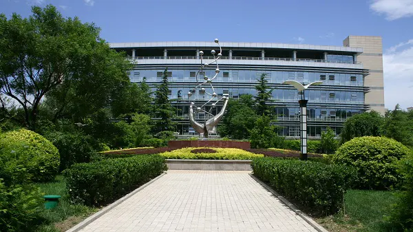
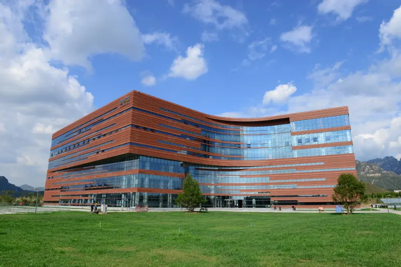
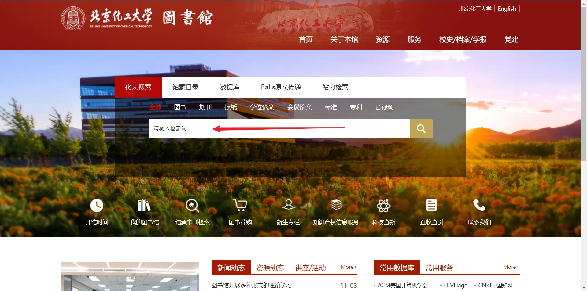
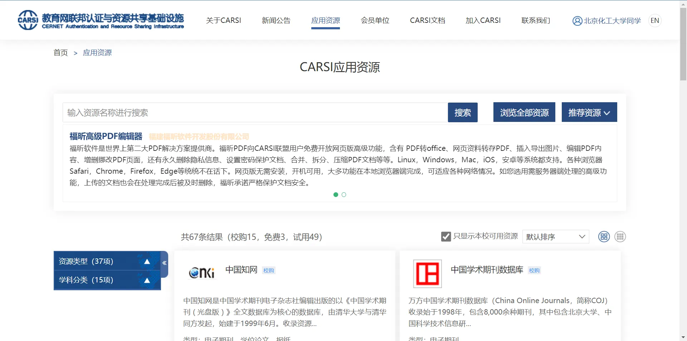

图书馆是同学们学习、工作的一个重要的场所，它为我们学习古今中外的知识提供了大量的图书资源。接下来我们介绍一下学校的图书馆，让同学们更加清楚地了解图书馆。

## [图书馆馆内介绍](https://library.buct.edu.cn/bgjs/list.htm)

*注：图片来源于[北京化工大学图书馆官网](https://library.buct.edu.cn/bgjs/list.htm)*

东校区图书馆建立于1958年，总面积达6万平方米，座位数量多达4500个，纸质图书多达181.6万册，随书光盘有10887种，21600张，数据光盘有4800张，数字资源量有21个T，电子图书有9个T，123万册，为师生们提供了大量的图书资源。

昌平区图书馆于2017年投入使用，面积达5万平方米，目前是北京市高校最大单体图书馆，昌平校区图书馆馆内设施齐全，功能丰富，并且各项工作均实现了云服务，目前为大一、大二、大三同学学习提供了很好的场所。

## [图书馆入馆须知](https://mooc1.chaoxing.com/zt/201661548.html)

图书馆新生入学教育网站是一个专门为新生介绍的图书馆的结构、馆藏、注意事项、借阅提示等功能的一个网站，网站以视频加文字的形式帮助同学们了解图书馆。

## [读者须知](https://library.buct.edu.cn/dzxz/list.htm)

## 图书馆功能简介

### [图书检索功能](https://library.buct.edu.cn/main.htm)

按照图中的箭头所示，输入想要查阅的图书，便可以查阅对应的资料文献，并且还可以点击输入框上方的文献类型缩小图书文献查找范围。 

### [校外访问](https://library.buct.edu.cn/xwfw/list.htm)

如果同学们不在学校里，没法连接校园网，但是又想通过学校图书馆查询文献资料，那么就可以点击图中箭头所示处“校外访问”。

按照提示进行登录操作。

登录之后，我们可以访问许多的资源，比如说大学生必备的知网，万维数据，中国学术期刊数据库等。如果能够熟练地运用里面的资源，那么一定能为学习带来巨大的便利与福利。

**引用：**

[北京化工大学图书馆官网](https://library.buct.edu.cn/main.htm)
