相信大家对于军训基地的很多事项都有疑惑，我们将会结合图片为大家详解北化军训！

本片推送内容以2018级和2021级军训为基础进行讲解，所介绍训练基地为北化多年来一直使用的军训基地，如有改动请大家以实际情况为准。

我们的军训基地在延庆一带，先来看一下训练营区的景色。

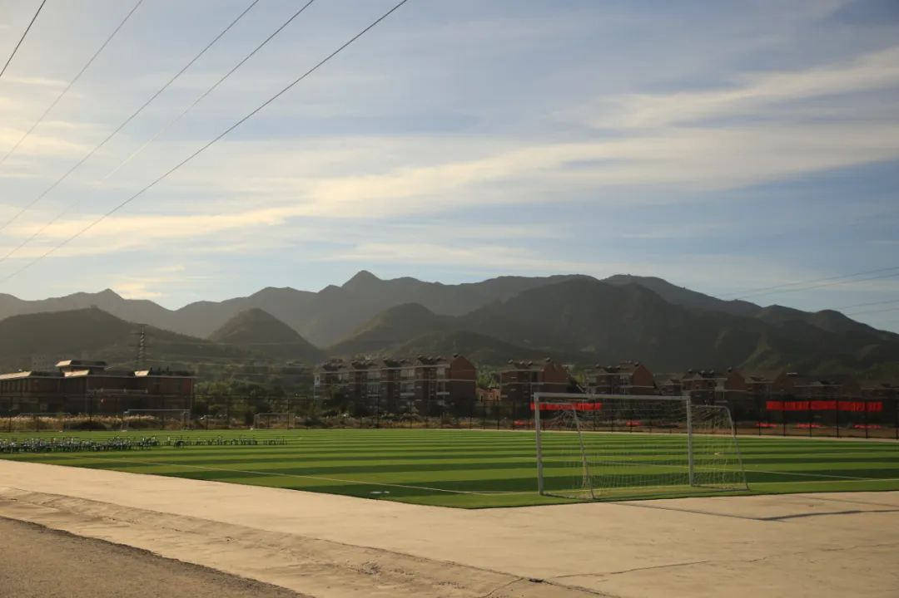

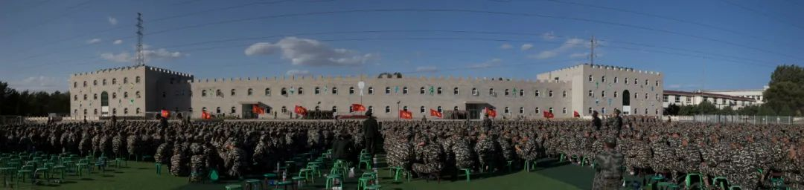

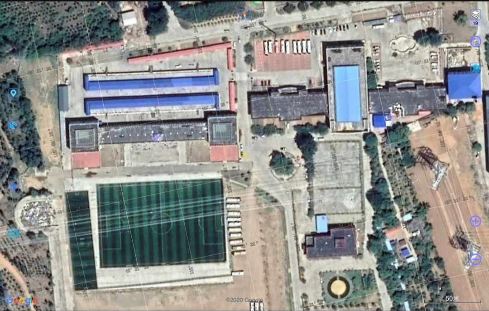

没看明白？下面一张平面地图供大家参考

营地处在大山脚下，早晚温差较大，刮风时伴有沙尘，空气较为干燥。有三排男生平房宿舍及一栋女生宿舍楼，一个沙地训练场，一个水泥训练场，两个草地训练场。

本篇推送将从衣食住行四个方面为大家全面介绍军训各方面内容，包括了14天的每日安排，相信能为你军训前的准备工作带来帮助！

## 衣

### 1.作训服装

军训前一两周学校会下发作训服装，包括裤子，短袖，外套，帽子，武装带，简章，胶鞋和身份牌（十分重要，不要弄丢）。

大家一定要提前试穿，选择最为合适的尺码。如果尺码不合适一定要即使更换。

衣服可能只允许整套更换，有点胖的同学可以换一套大一点的衣服然后用针线将裤腿缝到合适的高度。

### 2.鞋

鞋子方面学校允许带一双自己的鞋。大家一定要带最合脚的一双跑步鞋，训练场没有篮球场地，所以男同学们不用担心打友谊赛没有合适的篮球鞋穿。

带自己的运动鞋是为了野外拉练时穿，拉练需要负重走15公里，所以舒服的鞋很重要。

 
### 3.保暖衣物

训练基地的早晚温差较大，所以大家绝对不能只带作训服装。

以下为9月-10月军训时的建议和学校要求。通常教官要求是早晚训练可以在作训服外套外面添加一件羽绒服或者薄外套，但是在白天训练期间最外层衣物必须是作训外套（有身体不适者除外）。有时内层衣物只穿半袖会冷，所以允许在里面自行加衣服。

建议大家带一件薄羽绒服（也可以用于当枕头）以及套头卫衣等非帽衫类衣物。

### 4.洗衣服

并不建议大家在作训期间洗衣服。男生宿舍外配有少量晾衣架，女生楼内几乎没有晾衣架。但是基地风沙很大，很有可能一阵风刮过衣服就飘走了。所以建议大家带好充足的衣物如贴身短袖或打底衫。

### 5.口罩
出于疫情防控的要求，学校要求非军事训练时间学生全程佩戴口罩。军事训练过程中，教官指挥方阵扩散，并发出“摘口罩”指令后方可摘下口罩，正常训练。

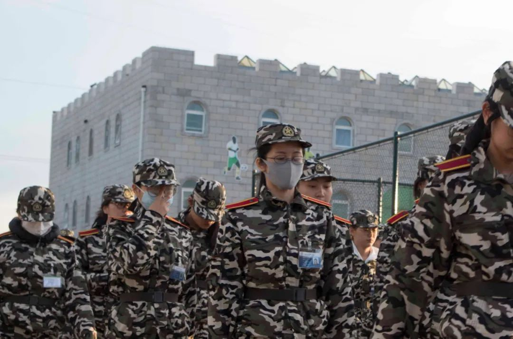

### 6.发型

军训期间男生一律寸头，到学校理发店说军训头师傅就明白。

女同学没有统一要求，但是建议大家不要留太长的头发，作训期间梳丸子头方便带帽子。

### 7.执勤军大衣

军训期间会安排执勤同学，包括哨岗，巡逻人员。全天24小时均有哨岗，夜间会有巡逻人员。晚六点到次日早六点的岗哨巡逻会配有军大衣进行保暖。站岗期间见到教官，辅导员，学校领导等需要敬礼，夜间巡逻遇人需询问口令。

## 食

### 1.饭菜

早餐有酱豆腐，鸡蛋，馒头，咸菜，粥。午饭和晚饭有蒜苗炒肉，狮子头，鱼丸冬瓜等。饭菜并不算好吃但是可以保证大家吃饱。

每桌安排值日生负责在训练结束前到餐厅为本桌同学准备三餐的食物。

其中米饭有可能会出现不够吃的情况，所以值日生一定要根据本桌同学的饮食习惯多打一些米饭。

建议大家带一些肉酱或者类似老干妈这种下饭的食物，如果饭菜不好吃可以自己加一些佐餐食物。饭后可以不将其带回宿舍，放在本桌上即可（要提前和值日生说好）。

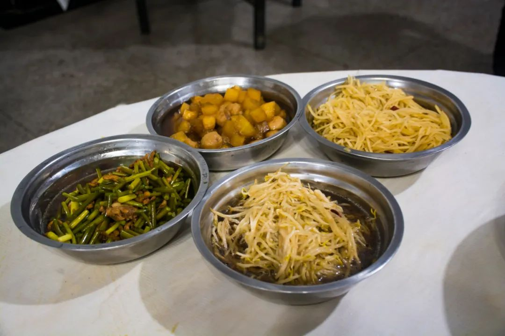

 
### 2.食堂
食堂要注意的是军训吃饭不提供座位，大家需要站着吃饭。且中午时分由于人员较多食堂内温度较高，大家就餐结束后可以尽快回宿舍休息。

 
### 3.小卖部
军训宿舍区内设有小卖部。基本的零食，泡面，饮料均有供应，价格略高但可以接受。小卖部内部设有热水桶为在小卖部购买泡面，奶茶的同学供应热水。

 
### 4.领导慰问

在军需第一周左右会有领导慰问和野外拉练，这一天的中午一般会加鸡腿。

### 5.回民餐

少数民族的同学不用担心，学校贴心地为大家准备了没有猪肉的餐饭。

就餐地点也与大部队不同，在食堂的二楼就餐且提供座椅，充分尊重少数民族文化。

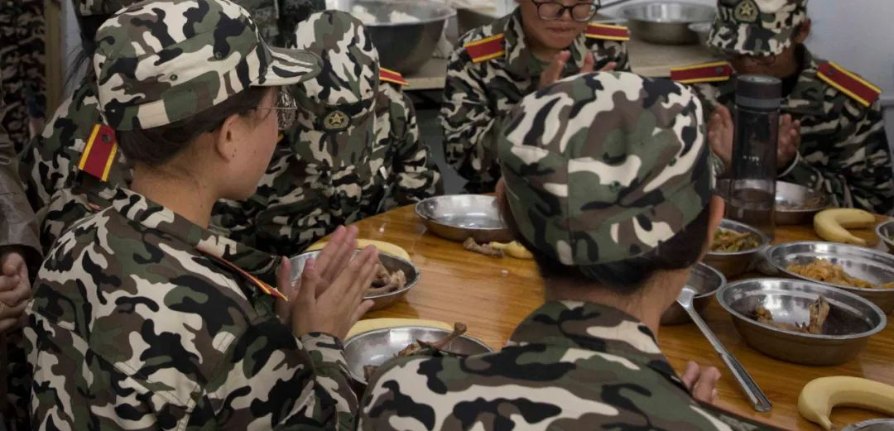
 
### 6.自己洗碗

要注意的是军训期间只向大家提供一个小盆和一个勺子作为就餐工具。

每餐开始前由值日生将餐具摆放至桌上，用餐结束后需要自行洗餐盘并放回桌面等待值日生收取上交。

由于无法保证每次用到的都是同一个餐盘，每名同学都要自觉清洗干净餐具，每个餐桌会向大家提供洗涤灵。

 
### 7.餐具消毒

每餐结束后餐具由值日生进行收取并上交辅导员，辅导员会将餐具统一集中并进行消毒处理，大家不用担心卫生的问题。

### 8.饮水

饮水方面学校为大家提供了充足的保障，宿舍区内女生楼下一般为接饮用水区域。学校只为大家提供开水，并没有凉水。有和凉水习惯的同学可以在宿舍内将水晾凉再喝。

### 9.训练带水

训练期间大家一定要带好水杯并充分补水。

训练场上的休息处同样为大家准备了接水处，不必担心训练时没有水喝。但是由于只提供开水，还是建议大家带一个大一点的水杯提前准备好凉水。

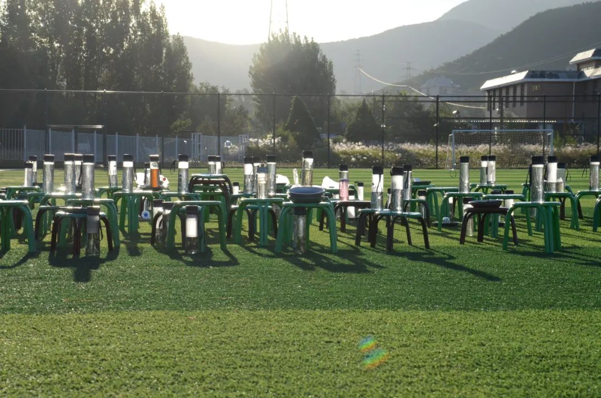

### 10.姜汤

由于训练基地早晚温差较大，学校可能会为大家准备姜汤取暖。供应时间为每晚训练结束后，地点在女生寝室宿舍区内的门口处，有需要的同学可以去接一些姜汤喝。

### 住

### 1.住宿概况

男女生住宿环境不同。男生宿舍为平房或者二层平房，每屋设有一扇窗户和5张上下铺。

女生宿舍为楼房，每屋一到两扇窗户，3-14张上下铺左右（视房型而定）。

床的长度在180-185之间（具体尺寸不知）。

注意军训期间不向大家提供枕头，只提供褥子和被子，且需要大家按学校规定购买指定床单被罩。有睡觉需要枕头的同学可以带一个充气枕或者用衣服垫着休息，但是要在每天早上训练前将枕头收到行李箱中，床上只允许放被子。

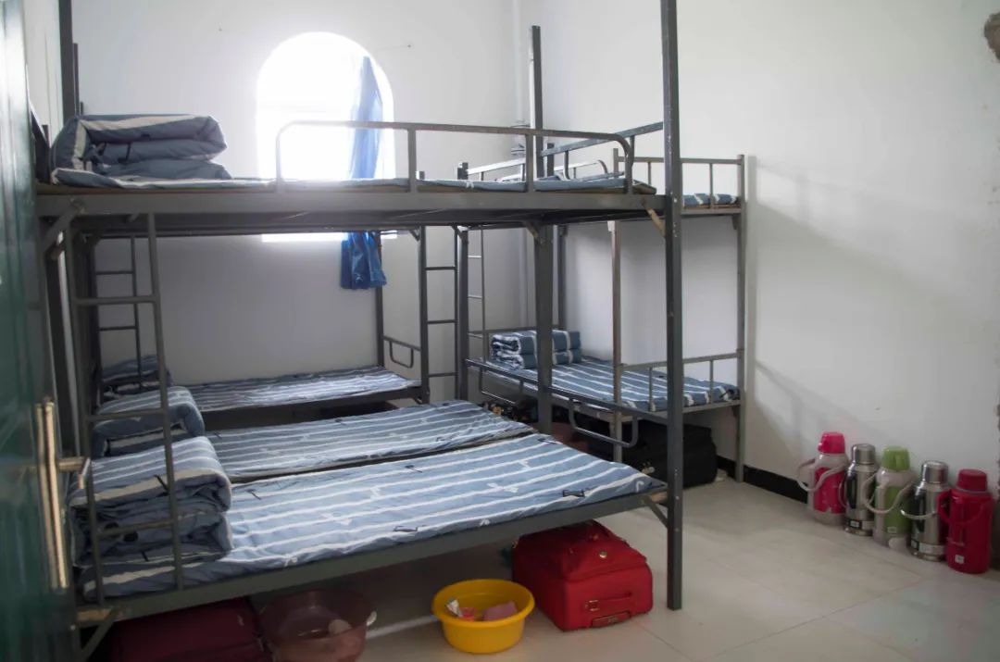

### 2.生活用品摆放

军训期间洗漱用品及行李摆放有严格要求。

每张床下摆两人行李箱及洗漱用品。须将牙杯，牙刷，牙膏放在盆内，将毛巾搭在盆的外侧。其余洗漱用品均不允许放在盆内，需要放在行李箱中。（行李箱上面也不允许摆放任何物品，否则会被辅导员收走）

每屋设有放置暖壶的位置，暖壶不得乱放。

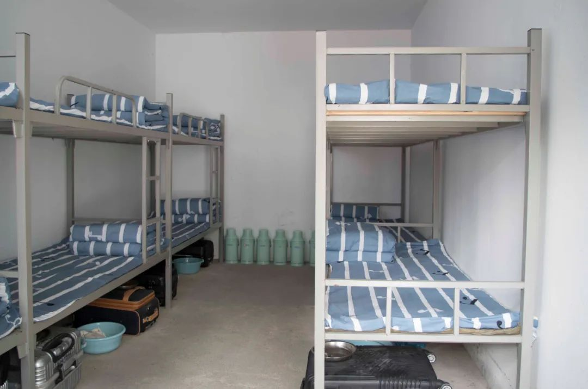

### 3.充电

不同于初高中军训，大学军训允许同学们带电子设备。但是并不像在宿舍一样提供充电插头。

男生宿舍的充电地点在宿舍门外的付费充电盒，价格比商场外租充电宝略高。

女生宿舍屋内有正常的插座，但是每屋可能只有一两个且不一定有电。

请同学们带好充电宝。其实训练一天下来还是很累的，大家晚上就不要玩手机了，早点休息准备第二天的训练！

### 4.洗漱台

男生宿舍的洗漱台在卫生间外侧，大概有几十个，早晚洗漱基本够用。人多的时候等一两个位置也可以洗漱。

女生宿舍由于在楼内洗漱间较小，据说不是很够用，如果不想集合迟到的话还是早点起去洗漱比较好。

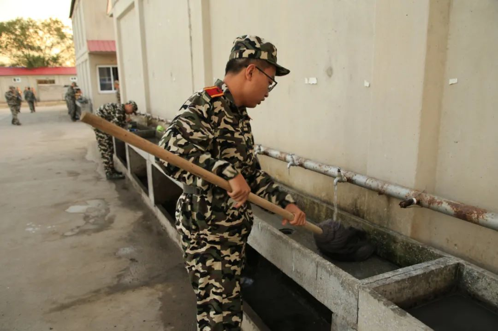

### 5.卫生间

男生宿舍卫生间为旱厕（不知道的同学自行百度在此不贴图），女生宿舍卫生间为正常卫生间，但是数量不多。

训练场中主席台下方为卫生间，不用担心训练时上厕所需要跑回营区的问题。

### 6.医疗设施

在基地内部和训练场上均设有医务室，有任何不舒服的情况一定不要硬撑着。

同学如果有病史不宜参加军训需提前向学校申请或者开具证明。

如在军训期间出现不适学校也会视情况安排。通常身体不适和免体的同学需要在其他人训练期间进行学习，准备器材等其他工作。

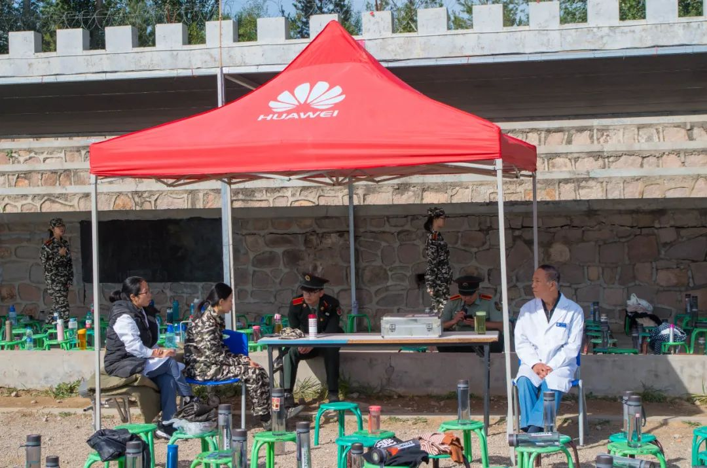

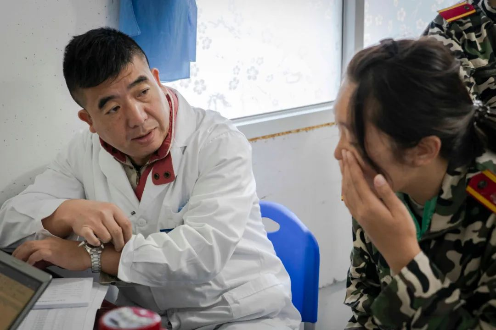

### 7.洗澡

相信大家一定很关心洗澡的问题。作训期间一共可以洗三四次澡，通常每隔三四天一次。

澡堂在食堂的后面，需要大家提前回宿舍换好轻便衣物，穿拖鞋拿盆集体前往，每次十五分钟左右，洗完澡自行返回宿舍区。

澡堂淋浴设施及更衣室较为简单，并无隔间等设施，不习惯的同学需要克制一下。

并不强迫洗澡，通常后几次洗澡人数由于一些同学不好意思而减少，大家可以自行把握。（记得上次军训最后一次洗澡只有几个人去）

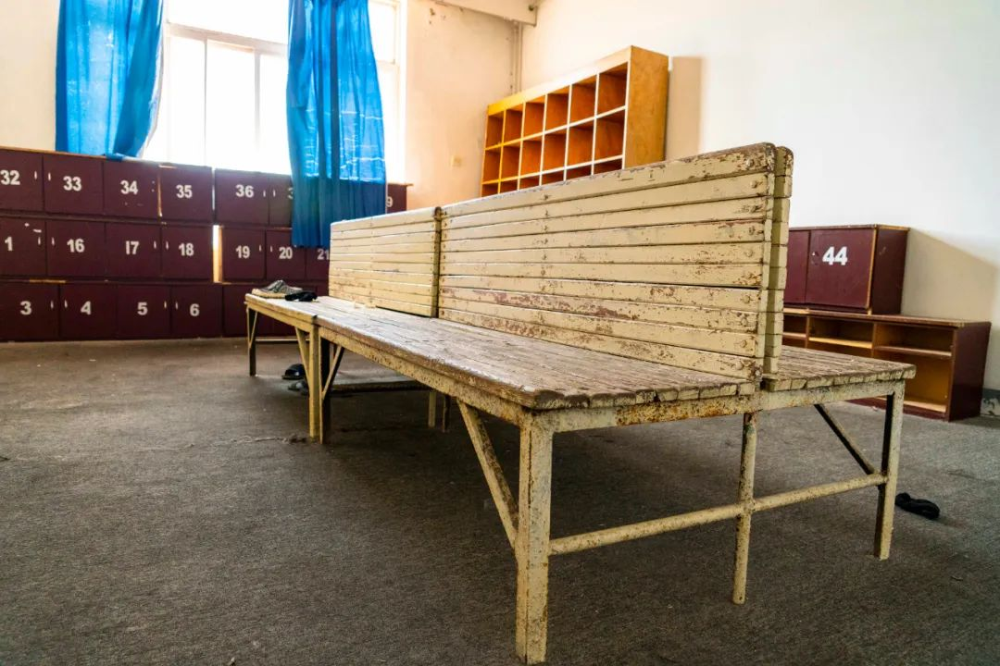

### 8.寝室内务

军训期间的内务要求十分严格，除了大家熟知的“豆腐块”之外，铺床单，卫生，生活用品摆放都有要求。

床单的条纹需要绝对竖直，不允许有任何褶皱。窗台，地板，电风扇内部均不允许有土。暖壶和小凳子有具体的摆放位置，行李箱，拖鞋，洗漱用品需按要求摆放在床下。

建议大家提前练习叠被子的技巧，如果不成豆腐块的话被子会被检查人员摊开以示警告。不建议购买“豆腐块神器”，很容易被查出来。

## 行

### 1.出发
前往军训基地通常为两车次。学校会提前为大家安排好时间，第一波人员在五点到六点间登车出发，第二波人员等待第一波车辆返回后出发。

由于首批人员出发时间较早，学校餐厅会在宿舍楼门口为大家准备付费早餐，大家可以自行选购。

车辆为公交车型的大巴车，由于行李较多所以车上会较为拥挤。在保证大家都有座位的情况下会在车厢内放行李箱，盆和暖壶等用品，大家注意安全。第二波人员可以在学校食堂就餐后统一安排。

### 2.返回

和出发前往军事基地情况相似，返校也分为两车次。学校会提前为大家安排好时间，第一波人员在下午先行登车出发，第二波人员等待第一波车辆返回后出发。在出发前，通常连队负责老师，会组织大家拍摄联队大合照，以此纪念虽苦累而又共同努力、记忆深刻的军训时光。

注：文章部分内容转载公众号“T学长的资料库”推送

[求转发！八达岭军训超全攻略请查收！百张2018级军训图片带你了解军训怎么过!](https://mp.weixin.qq.com/s/ngcGXcbSi0SggdZgk_eeuA)

（此公众号由北化学生创建，免费为大家提供包括但不限于北化历年期末试卷，课程复习资料，大学生各类竞赛备赛资料，四六级雅思托福备考资料，软件教程及安装包，PPT模板等存储高达20T的学习资料。）