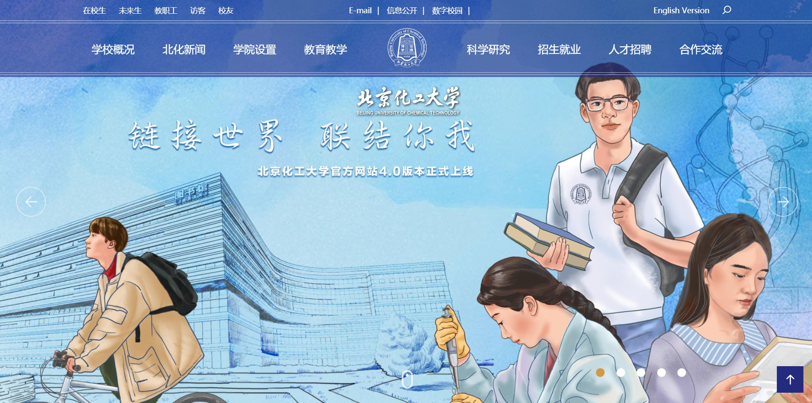
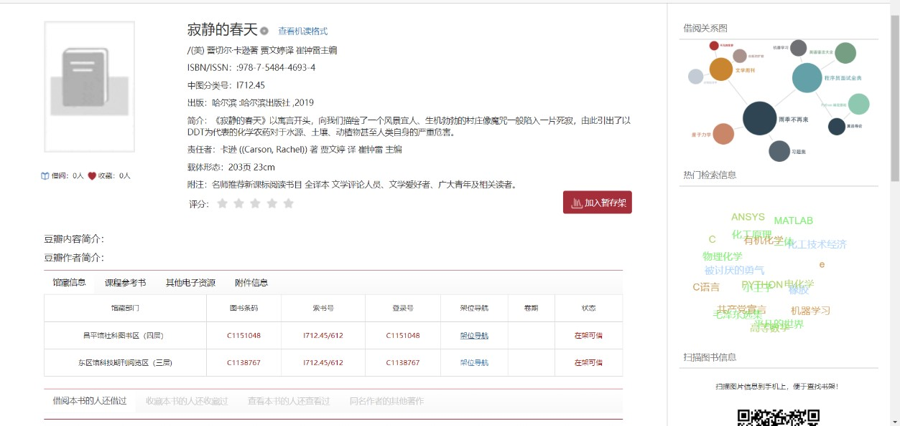
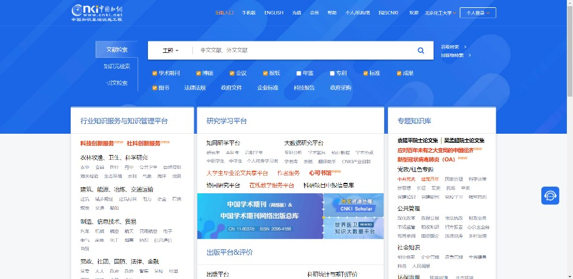
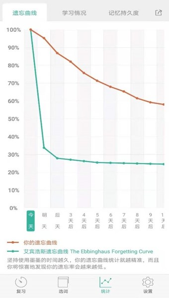

## 学校网络资源

### 1. 北京化工大学官网（[www.buct.edu.cn](http://www.buct.edu.cn)）

　　北京化工大学官网上提供了学校大部分的资源，接下来将介绍一下本科新生最常用的几种功能。

　　滚动到页面最底可以看到下图中的校园服务，接下来将围绕它的部分功能进行讲解。

#### 1.1 数字校园（<http://my.buct.edu.cn/>，下载windows和office等软件）

　　如果电脑上需要安装或激活Windows系统和office（包含word，ppt，excel等办公软件），可在数字校园内**下载激活**。没有初次登录需要填写账号密码，也可用企业微信扫码登录，登录后会显示以下页面。
　　

　　点击数字导航。
　　

　　打开正版化软件，可在网页内找到下载资源和其他实用工具。

　　使用学校提供的office软件需要先将电脑上其他版本的office卸载，再下载学校提供的版本，下载后使用激活工具激活。

#### 1.2 图书馆（<https://library.buct.edu.cn/>）

##### 1.2.1 馆藏书刊检索

　　同学们可以通过 “馆藏书刊检索” 查找图书馆内的书籍。

　　查找出的书籍可显示是否可借以及其他信息，若可借，可以前往借阅。

　　点击书籍，可以查看具体信息，注意图书所在的图书馆是在东区还是北区。

##### 1.2.2 文献查询

　　在做课程论文或者参加竞赛时，需要查阅文献。学校图书馆与许多数据库有关联，可以查阅国内外的论文资料。

　　以知网为例，登录需填写账号密码，进入后的账号为北京化工大学机构账号（在校园网下），在此推荐一个知网检索方法大全：<https://www.cnki.net/>

### 2. 北京化工大学教务管理系统（<https://jwglxt-proxy3.buct.edu.cn/jwglxt/xtgl/login_slogin.html>）

　　教务管理系统提供学生选课，查询学业情况，查看课表，查询空教室等功能，是经常要用到的网站。最常用的就是选课功能，在选课开放时间，学生在选课—自主选课中选择学习课程。

　　另一个常用功能列表是信息查询，点击后出现多个查询窗口。

　　学生课表查询：可查看已选课程的课表（包含在选课时间中选择的课程），课表在上课期间可能会有变动，所以需要注意老师的通知。

　　学生成绩查询与学生成绩明细查询：两者都可以查看成绩，但是成绩明细可以查看平时成绩、实验、期中和期末的成绩。

　　考试信息查询：可查找考试时间及考试地点，座位号等信息。

　　学生学业情况查询：可查询学生本人的绩点，还有本专业的所需学习课程，各部分已获得或未获得的学分等内容。

### 3. 北化在线教育综合平台（https://course-proxy2.buct.edu.cn/meol/index.do)

　　此平台是查找自己课程资源的重要平台，老师通常会在这里上传课件或教材等资料，有时也会在此发布作业。

　　打开网页后需要点击右上角的登录，填写账号密码后登录（账号密码与教务网相同）。

　　登录后会发现主页发生变化，会显示自己的一些信息以及本学年的课程和课程通知。

　　点击任一课程，可在单元学习或课程资源内找到老师上传的资料。

## 校外学习资源

### 1. 中国大学MOOC

　　中国大学MOOC是由网易与高教社携手推出的在线教育平台，承接教育部国家精品开放课程任务，向大众提供中国知名高校的MOOC课程。

### 2. 虎课网

　　虎课网集合了设计、办公等软件的使用教学，有兴趣在课外学习其他专业软件的同学可以在此网站找到自己感兴趣的课程学习，不过需要注意谨慎购买课程，选择之前可以找一些免费课程观看，了解自己是否真的感兴趣。
　　

### 3. 哔哩哔哩弹幕网（[www.bilibili.com](http://www.bilibili.com)）

　　b站有着众多知识分享视频，在学习上遇到的大小问题基本上都能在这里找到答案，这里不仅有专业课程的分享，也有着其他各种问题的解决办法。

## 自习位置

### 1. 教学楼

　　教室是同学们常用的学习地点，北化的教学楼里每天都有前来上课自习的同学，所以有必要学会如何找到空闲的位置。

　　打开教务管理系统，选择“查询空闲教室”。

　　根据自己的需要进行筛选，点击查询就可以显示出空闲教室。

　　此外，教学楼内走廊也设置了一些学习区域，推荐需要背诵或者进行研讨交流的同学使用（不推荐需要安静环境学习的同学使用）。

### 2. 图书馆

　　图书馆为同学们提供了一个安静的学习环境。图书馆的二、三、四层是同时存放图书和放置自习座位的地方，相比教学楼自习位置较少。在非备考时间段，图书馆的座位不是很紧张，但在考试周（考试月）座位会相当紧张。

### 3. 宿舍楼三、四层

　　宿舍楼的三、四两层设有自习区域，位置不多，且宿舍楼里偶尔会比较吵闹，但是因在宿舍楼里离宿舍较近，更方便一些，同学们可适当考虑是否选择在这里自习。

## 学习软件

### 1. 墨墨背单词

　　墨墨背单词是现在备受好评的背单词app，最特别的一点是通过对学习情况和记忆情况的分析，对学习进度进行调整，自动制定学习规划。其中词库收录了不同需求的词汇表，满足四、六级和考研英语的需求。缺点是免费单词上限用完后需要另行购买。

　　其他背单词的app如知米背单词也比较推荐。

### 2. Forest专注森林

　　这是一款让人离开手机，专注学习与工作的软件。在主界面定好时间开始倒计时后，使用软件之外的操作会导致计时暂停，开始种下的“树苗”死亡，需要重新开始计时。在预设时间内没有进行其他操作使树苗顺利存活后，会在“森林”里种下你刚才种好的树，开始设置的时间越长，树就越高。在多次使用后，森林里会种满你所完成的树，也反映了你专注的时间，收获一定的满足感，但最重要的是提高了自己的专注能力。　　

