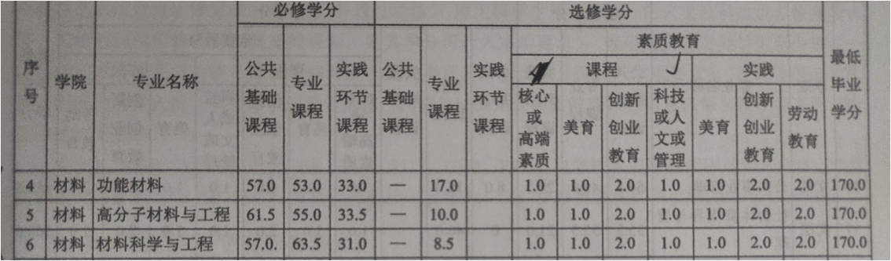
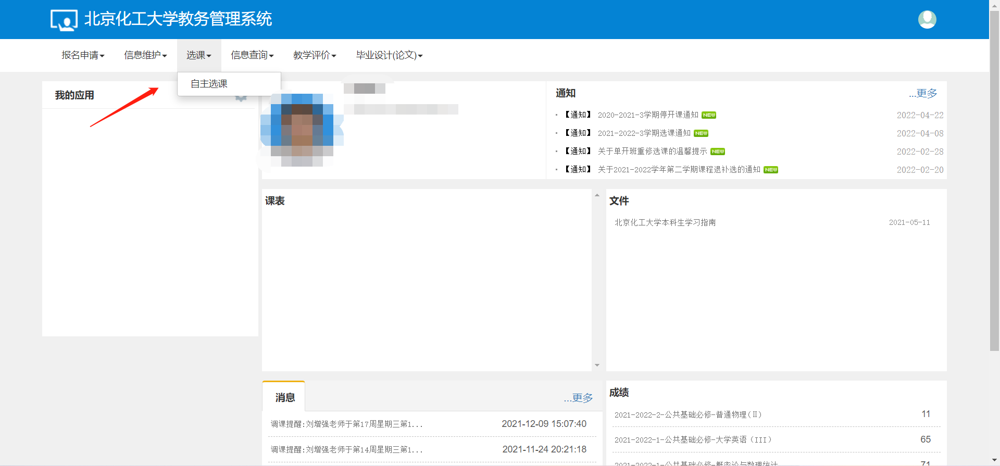
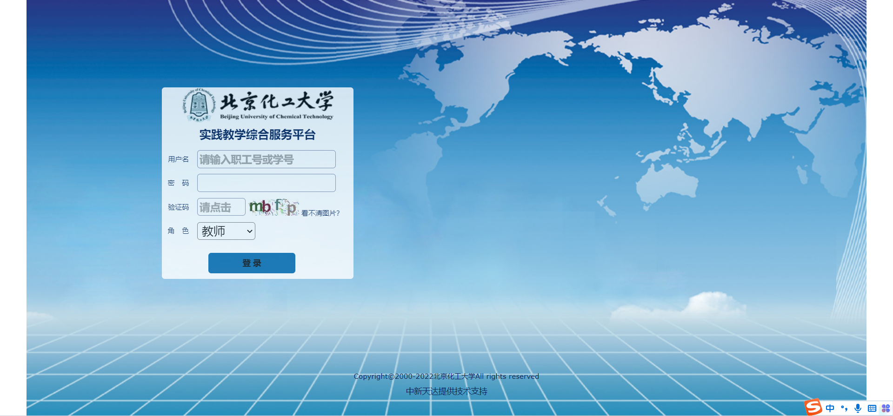
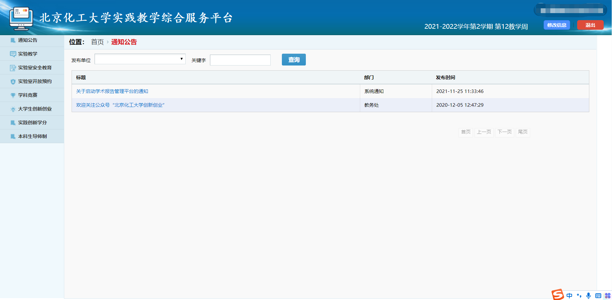

同学们在第一次进入大学的时候，都会发一本名叫本科生选课手册的书帮助大家去了解大学所学的课程以及所需要修习的学分，但是不少同学反映对本科生选课手册中的学分方面有些疑问，今天我们对这部分进行一个全面的解析。

学分分为必修学分、选修学分以及书本上未提及的实践学分，必修学分是学校会安排的课程，只要同学们能保证参与每一个课时的学习，即可获得必修学分；选修学分就需要大家主动进行选课，修够一定的、固定的学分才可以毕业；实践学分则是需要我们在大学四年时间内通过看讲座或者参与竞赛等方式获得学分，完成要求。所以接下来就给大家重点讲解选修学分和实践学分。
## 选修学分
选修学分需要同学们通过教务管理系统中的选课界面进行选取。  
[教务管理系统](https://jwglxt-proxy3.buct.edu.cn/jwglxt/xtgl/login_slogin.html)

点击选课中的自主选课按钮，如果是在选课时间，会显示选课界面，这时，同学们就可以选择选修学分啦。但是，素质教育实践一类的学分是不能选取的，这类学分是由学校安排课程来进行选取的。

那么，同学们选完课之后，如何检查自己的选修学分有没有超出或是不够呢？  
这里推荐一个简单的方法，大家可以通过信息查询中的学生学业情况查询，在这里，同学们可以检查自己的学业，如选修学分、GPA等。

## 实践学分
实践学分大学期间需要修够两分，但是这个学分不是在学生学业情况中，需要大家登录另一个平台去学习——北京化工大学实践教学综合服务平台。  
[北京化工大学实践教学综合服务平台](http://sjcx.buct.edu.cn/aexp/login.jsp)

同学们可以输入这个网址直接进入，但是这个网页的密码是需要在北化在线上修改密码之后，用修改后的密码才能进入。另外，还可以从北化在线中转，用企业微信扫码加载登陆。

登录进去之后点击右侧实践创新管理平台即可。

