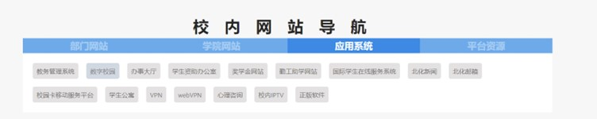
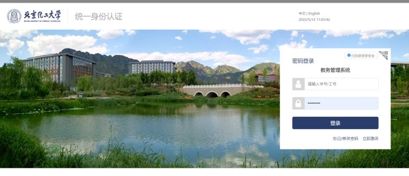
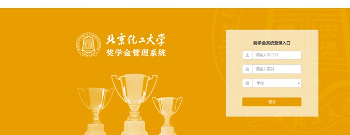
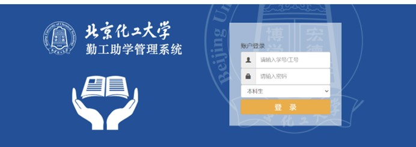
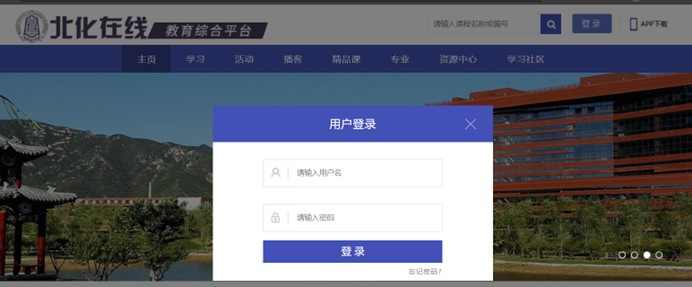

学校里有很多和同学们日常学习生活相关的网站，例如邮箱、奖学金系统、校园网等，但是由于这些网站的密码不完全统一，所以常常会有同学遇到忘记密码的情况。今天这篇文章就带大家直观的了解一下当我们忘记密码的时候，如何快速的找回。 

首先是与数字校园相关的网站

教务管理系统，数字校园，办事大厅，校内iptv用的都是数字校园统一身份认证。

如果忘记密码直接点击忘记密码，进行身份认证之后重新设置密码。

奖学金系统和勤工助学系统为学校统一安排的密码，不支持修改密码，如果忘记密码需要联系辅导员。

北化邮箱具有找回密码功能，需要企业微信登录认证之后找回。

Webvpn网站密码与校园网密码一致。如果忘记密码需要在[校园网网站](http://202.4.130.82/)重置。

北化在线平台的密码支持找回。需要登录邮箱找回。

外语教学平台，外语测试系统的密码如果忘记，需要到语音室(实验楼F305)找老师修改。

