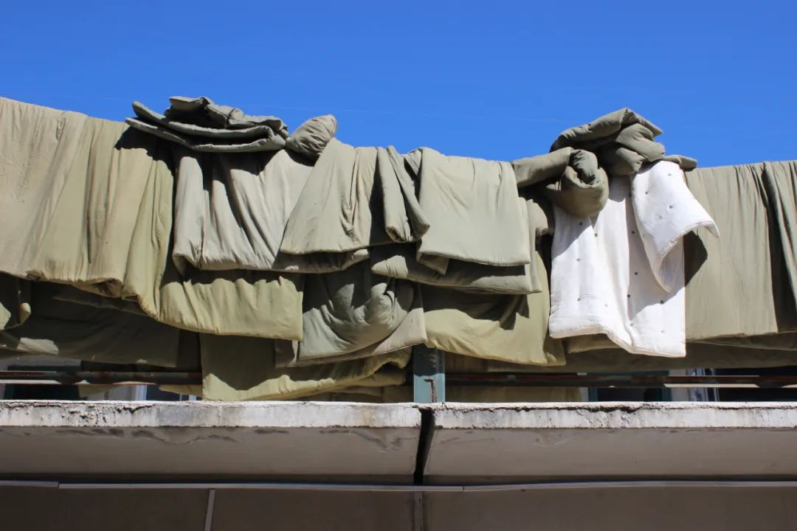
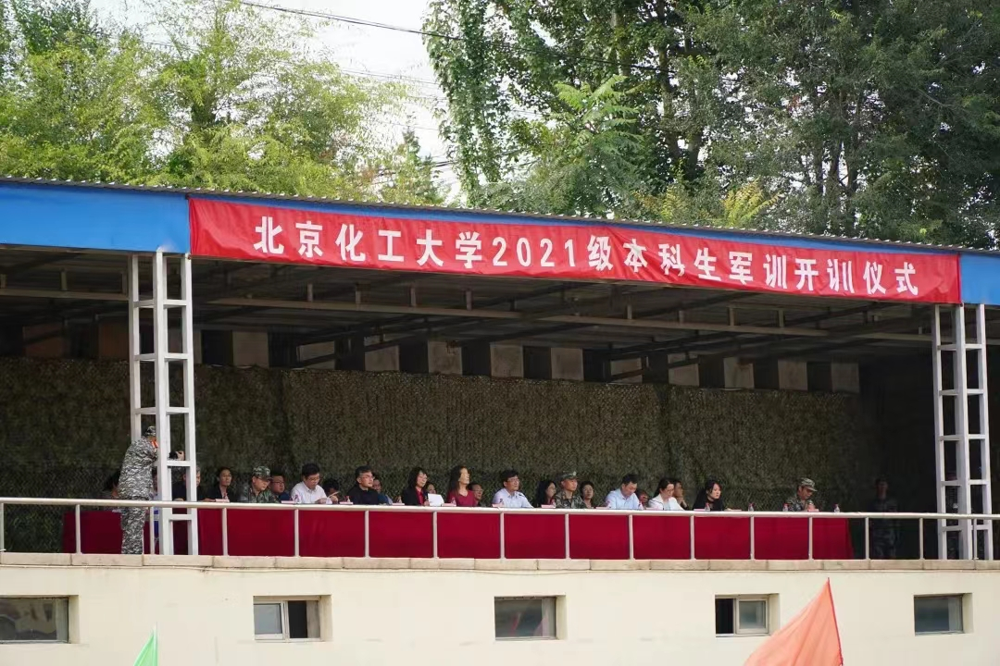
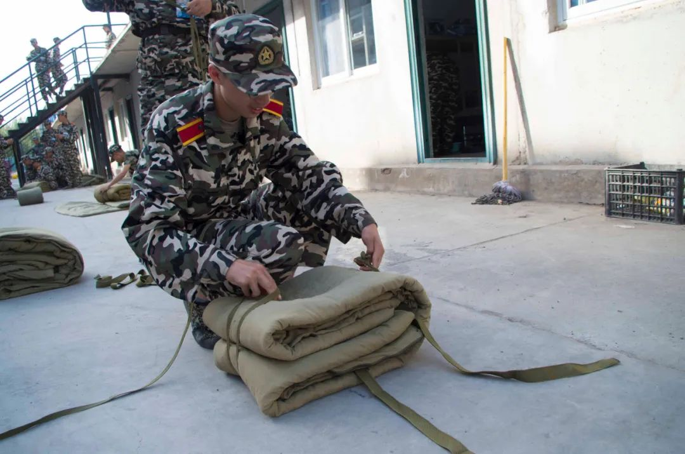
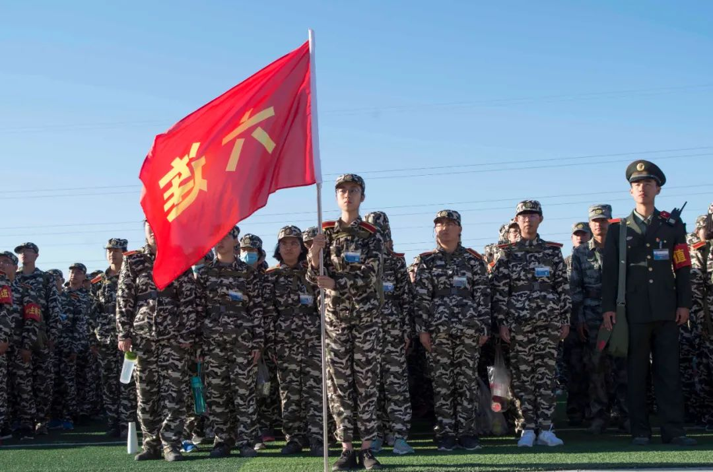
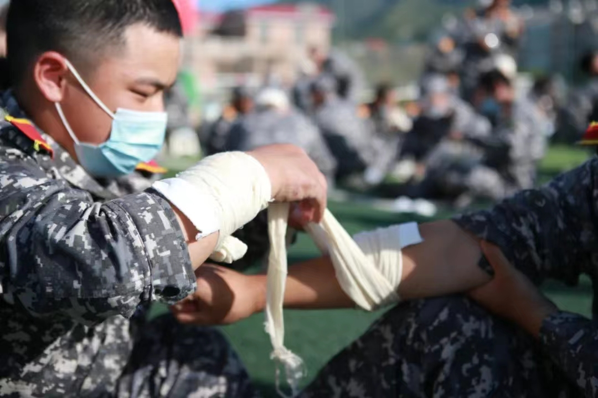
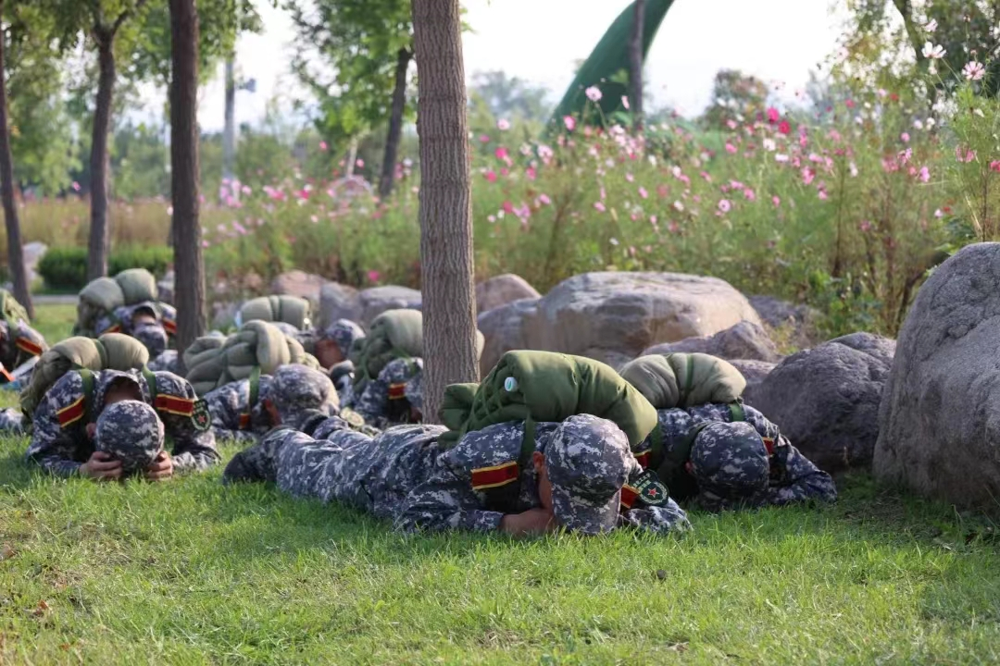
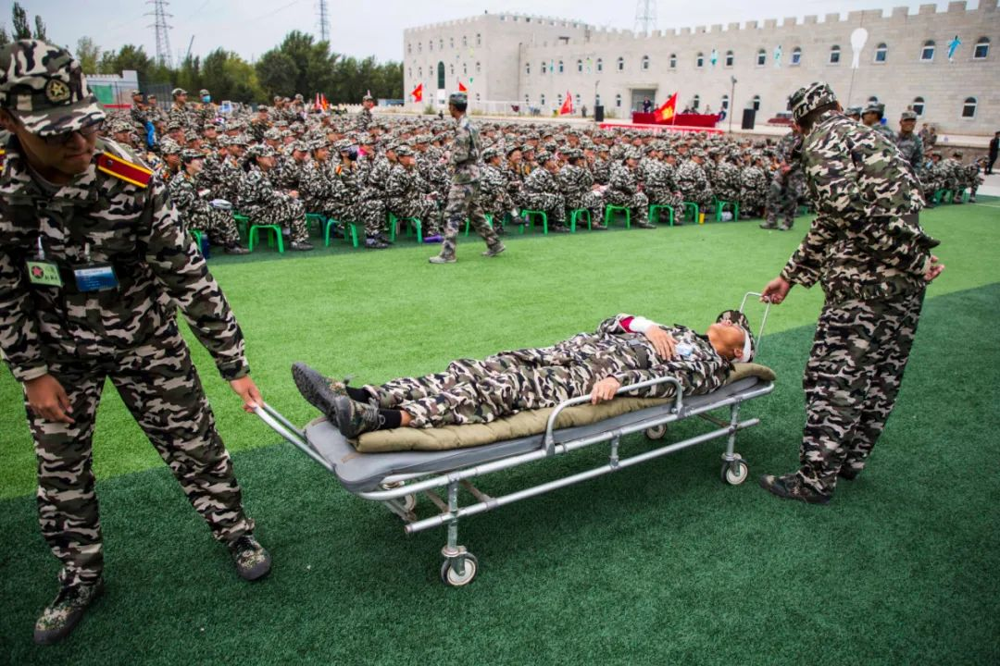

本部分将按照2021级在八达岭军事基地军训时14天的顺序安排为大家讲解，可能部分事项新生军训没有或者时间安排不同，因此仅供参考。

## 第一天

早上

前往军训基地通常为两车次。学校会提前为大家安排好时间，第一波人员在五点到六点间登车出发，第二波人员等待第一波车辆返回后出发。

由于首批人员出发时间较早，学校餐厅会在宿舍楼门口为大家准备付费早餐，大家可以自行选购。

车辆为公交车型的大巴车，由于行李较多所以车上会较为拥挤。在保证大家都有座位的情况下会在车厢内放行李箱，盆和暖壶等用品，大家注意安全。第二波人员可以在学校食堂就餐后统一安排。

上午

抵达军训基地后统一听安排进入宿舍区，整理内务。

建议相互配合先将被子拿到外面抖抖土或者晒一下后再套床单被罩。通常大家铺的床单都是不合格的，教官会让每个宿舍出一名宿舍长去学习具体操作。

打扫卫生要求也很严格，包括风扇都要拆开将内部清洗干净，扫地墩地擦窗户洗纱窗更是基本操作。

中午

第一次吃饭前教官会帮忙分桌子，通常一桌十人。要记住自己就餐的位置，此位置将不会变动。其他事项在上文中已经提到不再赘述。

下午

第一天的下午是开营仪式，同学们会被统一带到训练场集合参加，展开学校、承训部队、基地三方见面会。每人会领到一个小凳子用于休息，以后每天训练都要带小凳子和水壶出操。大家要记住自己的连队号和口号。

晚上

晚餐过后会有一段在宿舍的休息时间。集合后由教官带队进行晚训，晚训任务相对轻松，以拉歌为主。有才艺的同学一定要踊跃展现自己。

合唱队，晚会展示人员要进行相关训练。晚训结束后各学院会开学院总结会，由辅导员组织总结当日训练情况等事项。

回宿舍进行内务学习，结束后休息。熄灯较早，大家回寝后要抓紧时间洗漱。夜晚不允许在营区随意行走，会有执勤人员询问口令。

## 第二天

上午

由于全年级人数众多，作息时间会有两部分安排。一部分同学先吃早饭再训练，另一部分同学先早训再吃早饭。轮换时间为一周，第二周开始两部分同学时间更换。饭后教官带队进行立正稍息、整齐报数、停止间转法等基本训练。

下午

教官带队训练，学习蹲下与起立、立正跨立、徒手敬礼等内容，校领导及辅导员进行第一次内务检查。所以大家一定要收拾好寝室内务，午休时不要把被子展开睡觉，否则很难在几分钟内叠好被子。

晚上

日常晚训，部分学院会组织联谊或讲座，可能会分批次组织参观国防教育展。辅导员例行总结教育。

## 第三天

上午

练习首日学习内容，学习齐步走。

今天是国防教育日，根据北京市人民政府安排，学校在军训基地鸣响防空警报，21级参训师生进行了紧急防空疏散演练。

下午

下午开展了国防知识讲座。铭记历史，展望未来。

晚上

组织观看爱国主义电影，弘扬爱国主义精神，增强国防观念。

## 第四天

上午

正步走训练，以及学习跑步行进与立定，部分学院展开第一次内务评比。

部分学院进行（识图用图）军事定向越野比赛。

比赛区域为草地训练场，场内会用障碍物拼成不同的形状，放置几十个打卡点。每名同学将拿到一个打卡指环，根据地图标记和自己的路线寻找相关打卡点打卡，记录完成任务的总时间选拔各学院的院队。

下午

齐步跑步互换训练和部分学院进行（识图用图）军事定向越野比赛。

晚上

日常晚训，部分学院安排洗澡

## 第五天

上午

进行正步行和立定分解动作、连贯动作的训练，和（识图用图）军事定向越野比赛。

下午

日常训练，部分学院进行定向越野和拔河比赛。晚饭前回寝室取被子和背包带在操场上学习打背包（此时要去掉被套），部分教官会在营区内或楼内教授如何打背包。部分学院进行（识图用图）军事定向越野比赛。

晚上

日常晚训，睡觉前需要再次抖土重新套被套

## 第六天

早上

日常早训

上午

准备人员分队，全营人员需分为队列展示，匕首操展示，军体拳展示等展示队伍进行后期不同训练。部分学院进行（识图用图）军事定向越野比赛。进行第一次内务评比。

下午

在各自训练场地，学习战场医疗救护知识。每位同学收到三角巾急救包，教官会进行几次演示，然后前后排同学组队进行模拟包扎。每个连队会选出两位包扎又快又好的同学进行现场包扎评比。

晚上

中秋佳节，晚上各学院组织晚会，表演节目。

## 第七天

上午

学习枪械使用的知识，进行激光射击实操训练。会进行评比。

其他同学进行正常训练。

下午

部分学院领导视察，全营组织队列会操展示。每学院分别派出男女生两个班级进行展示，具体班号和展示顺序抽签得出。

全营共同观摩展示，内容包括敬礼，转向，齐步走正步走等项目。结束后由校领导，教官打分评选。

晚上

学习战备与行军拉练有关理论，训练较为轻松，大家可以早点休息。

## 第八天

上午

各学院板报组的同学准备板报展示。

下午

进行野外拉练项目，从营地出发前往八达岭长城。全程15公里左右，教官和辅导员会在队伍前后引导车辆，如有不适可以打报告，学校准备了休息车辆。

三个小时的拉练包括烟雾弹、空袭、炮击、包扎伤员、传递口令、卫星侦测，大家迎难而上，出色地完成了挑战。

晚上

日常晚训，部分学员领导讲课，心理老师开展心理辅导课程

## 第九天

上午

学校党委书记/校长视察军训情况，拟定方案，开始方阵与特色科目训练，以及进行拳术评比，午餐加鸡腿.

下午

队列展示，军体拳，匕首操等分开训练。军训团进行了军体拳评比活动。

晚上

日常训练

## 第十天

上午

进行方阵与特色科目训练，生存训练（埋锅造饭）。

下午

进行第二次军训内务评比。

晚上

日常晚训

## 第十一天

上午

队列展示，军体拳，匕首操等分开训练，辅导员开展团课活动。

板报评比环节，由校领导参观板报区，听讲解员讲解后进行打分。其他同学收听讲座。

下午

训练内容同上.

晚上

日常晚训

## 第十三天

上午

正常训练

下午

全营展开了2021级新生消防安全综合演练，配有烟雾，火警警报等道具。

男生正常从营区撤离至操场即可，女生宿舍楼内会释放烟雾，有一定的刺鼻性，需要尽快撤出。

全员撤出后会在楼内模拟着火点，楼外消防车用高压水枪模拟灭火，所以女生撤出前一定要关好窗户。

全员抵达操场后收听校领导讲话及消防安全讲座。操场上还会进行模拟伤员救治，消防逃生等体验设施。

晚上

军训团组织了以“军旗跟着党旗走，成才报国守初心”的合唱比赛。曲目分成必选曲目和选唱曲目两部分。必选曲目是“没有共产党就没有新中国”。各连队通过历史红歌，为建党百年献礼。

在最后，导员们还一起合唱了“小幸运”，在温情中落幕。

## 第十三天

上午

日常训练

下午

全营第一次结训仪式合练，由北化国旗护卫队升国旗，后依次进行展示项目，进行结训演练。

晚上

全营晚会，由各学院及全院辅导员展示才艺，全营观摩。

## 第十四天

上午

结训仪式

下午

收拾行李准备回校，同样分为两批次返回，由此军训结束。

军训生活，说起来两周仿佛十分难熬，但结束后才觉得弥足珍贵。希望大家珍惜这段时光，感受军人生活的辛苦，学习军人的品质，更好地投身到以后的学习生活中来。

注：文章部分内容转载公众号“T学长的资料库”推送

[求转发！八达岭军训超全攻略请查收！百张2018级军训图片带你了解军训怎么过!](https://mp.weixin.qq.com/s/ngcGXcbSi0SggdZgk_eeuA)

（此公众号由北化学生创建，免费为大家提供包括但不限于北化历年期末试卷，课程复习资料，大学生各类竞赛备赛资料，四六级雅思托福备考资料，软件教程及安装包，PPT模板等存储高达20T的学习资料。）