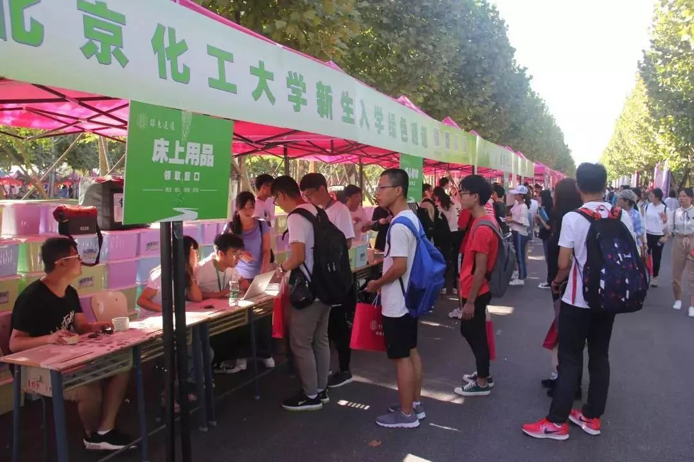

入学后的新生期一直安排地较为紧凑，很多安排新生并不知道具体情况，只是跟着大家一起进行，比如新生必须参加的入学考试安排、计算机免修考试的安排等，因此有一个具有完整的时间线和流程内容的攻略是十分必要的。这里就为大家整理出了一份新生期攻略。

## 入学教育

新生入学教育内容包括：开学典礼及校长第一课，校风学风报告，人才培养与本科教育，规则、规范和安全教育，首日教育、专业教育和学业教育，主旋律理想信念教育，职业生涯教育和全程就业指导，生理心理健康教育，新生党员教育，朋辈引领等。还包括新生体检、组建班集体、辅导员的年级会等等。

## 体检、打疫苗

学校会下发体检表单，学校体检内容包括内科、外科、五官科、色（嗅）觉、血压、视力、心电图、抽血、胸透。同学们在体检时务必携带校园卡、导检单和体检单。体检需要交费，具体费用和缴费方式校医院会统一公示。根据北京市防疫部门的统一要求，新生入校后必须统一接种麻风腮疫苗。同时昌平区根据属地管理的要求会对所有新生进行结核 PPD 测试，这个测试是免费的，后续的结核疫苗采取自愿原则。

## 入学考试

入学考试包括英语、语文、逻辑学等学科，成绩在学院前百分之五的会有1000元的优秀生表彰，同时有一次转专业机会。

其中英语考试也是英语分级考试（英语专业不参加），是划分英语快慢班与普通班的依据，快班学生直接学《大学英语 B》，《大学英语 C》成绩由分级考试成绩折算而来，能在大一就考四级；慢班和普通班学生从《大学英语 C》学起，大二上学期考四级。普通班排名靠前的经老师培养考核并择优推荐可以于大一下学期考四级。

## 绿色通道

为帮助家庭经济苦难的同学顺利入学，减轻家庭经济压力，我校特别设立新生入学通道，学生在开学报道时通过“入学绿色通道”，可以申请缓交学费、住宿费，方便快捷的办理入学手续。此外，学校还采取发放生活用品、学习用品、床上用品、爱心教材、助航基金、伙食补贴等形式对学生进行资助，为经济困难的同学排忧解难。

 
*绿色通道*

[北京化工大学绿色通道](https://www.sohu.com/a/334053679_407292)

## 户口迁移相关

户口迁移采取自愿原则。迁户口无好坏之分，入学当年，学生自愿选择是否转移户口。入户指标当年有效，自愿不转移户口的学生，在读期间不可再办理户口转移手续，学生自愿将户口迁至学校集体户口后，在读期间不得办理户口迁移手续。
 
**注意**：迁户口的机会在校只有入学这一次，逾期不办理，户口一旦迁入，只有毕业或退学才能把户口迁出。办理户口迁移证时，迁往地址是：北京市朝阳区北京化工大学。

## 计算机免修考试

“大学计算机”课程在开课之前，将进行一次课程免修考试，考试通过的同学将无需参与线下课堂教学活动（包括结课考试），只需完成慕课的学习（包含线上的测试、讨论和考试）。免修考试自愿报名，鼓励有一定计算机基础的同学尝试，考试不需要报名费。

>免修考试包括：   
1、判断题5分  
2、单选题20分  
3、多选题10分  
4、Word操作题1道，20分  
5、Excel操作题1道，25分  
6、PowerPoint操作1道，共20分  

*题型以2021年为例，仅作参考*

录取通知书资料袋中包含大学计算机课程学习的说明，有时间的同学可以提前在慕课上进行学习，为之后的考试打下基础。具体考试安排同学们听取任课老师通知。

## 快递站攻略

昌平校区快递收取地包括菜鸟驿站、后勤楼收发室，菜鸟驿站入驻了京东、顺丰等各大快递商，同时也是一个多多买菜自提点，菜鸟驿站开放时间为8:00-19:30。

新生入学时注意区分不同快递商快递摆放的位置不同，详情可以询问快递站工作人员，从而更快捷地收发快递。

*注：部分内容参考新生百问*