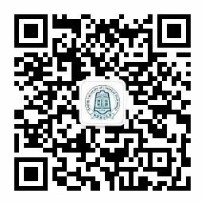

## 学工办

工作时间：

>周一至周四9:00-17:00  
    周五9:00-12:00

### 1号窗口——学生发展服务岗

服务电话：80191130

办理事务：

1.学业发展咨询预约服务

服务关键词: [学业发展](https://www.wjx.top/m/72413713.aspx)

申请材料：《北京化工大学学业发展咨询预约登记表》，现场领取。

服务流程:

>① 填写《北京化工大学学业发展咨询预约登记表》；  
    ② 岗位建档，领取《北京化工大学学业咨询学生档案》，与相关咨询师取得联系，确认双方咨询时间和地点，提前10分钟到达指定地点；  
    ③ 咨询过程，咨询师完善《北京化工大学学业咨询学生档案》；  
    ④ 咨询结束，回到岗位，归还《北京化工大学学业咨询学生档案》，填写《预约情况反馈表》。  

受理部门：学生工作办公室（学业发展辅导中心）

在线预约服务：[学业发展咨询在线预约服务](https://mp.weixin.qq.com/s/6aTGfaJZo-A6UNXBzIhcvA)

电话预服务：拨打010-80191130（工作时间）

其他相关信息：学业咨询专家库

2.就业创业指导服务（弱化，待详细询问）

服务介绍：

服务流程：

3.出国留学咨询服务（弱化，待详细询问）

服务介绍：

服务流程：

4.心理咨询辅导服务（弱化，待详细询问）

服务介绍：

服务流程：

### 2号窗口——国防教育咨询岗
服务电话：80191132

服务关键词：军训，征兵、应征入伍、当兵

办理事务：

1.新生军训事务咨询（待完善）

服务介绍：提供新生军训相关事务的咨询。

服务流程：直接到一站式服务大厅2号窗口咨询。

2.征兵入伍咨询

服务介绍：为学生提供征兵入伍政策咨询服务，收集征兵相关材料信息。

申请材料：《应征公民政治审查表》、《政治考核谈话表》、《应征公民走访调查表》。

服务流程：直接到一站式服务大厅2号窗口咨询。

受理部门：学生工作办公室（学工办武装部）

办公地址：行政楼429室（东校区）、后勤服务楼F座402室（昌平校区）。

联系电话：010-64435703（东校区）、010-80191085（昌平校区）。

其他相关信息：[武装部](https://wzb.buct.edu.cn/main.htm)

### 3号窗口——助学贷款服务岗

服务电话：80191135

服务关键词：资助办，助学贷款、助学金、奖学金

办理事务：

1.各类奖、助学金发放情况查询

服务关键词：奖学金、助学金。

服务介绍：查询各类奖学金和助学金发放情况，核实奖学金、助学金发放明细。

服务流程：到一站式服务大厅3号窗口咨询。

线上查询方法：

>① 关注“北化资助”微信公众号；  
    ② 点击功能栏里“资助查询”，首次查询需要进行“学号绑定”；  
    ③ 绑定信息：学号（学生自己的学号），姓名（对应学号的姓名），身份证号（对应姓名身份证号）；  
    ④ 选择查询的月份即可查询相关信息。  

2.校园地国家助学贷款（校园地）工作咨询与受理

服务介绍：为学生办理校园地国家贷款，为家庭经济困难的学生提供助学贷款服务，解决学生实际的经济困难问题。

申请材料：《北京化工大学学生家庭经济情况调查表》、《国家助学贷款父母确认书》、父母及本人身份证复印件。

服务流程：

>① 学生载相关材料填写完整，备齐其他相关材料；  
    ② 提交至窗口或学生资助办公室，由学生资助办公室审核；   
    ③ 审核完成盖章后，提交至中国银行。  

受理部门：学生资助办公室

办公地址：行政楼429（东区）、后勤服务楼F座415室（昌平校区）

办公电话：010-64435218（东区）、010- 80191078（昌平校区）

其他相关信息：[学生资助网（校园网访问）](https://zizhu.buct.edu.cn/)

（1）校园地国家助学贷款还款服务（在线办理）

服务介绍：针对校园地国家助学贷款毕业生，为本科毕业生、硕士毕业生提供校园地国家助学贷款的还款服务。 

服务流程：

①	关注“北化资助”公众号，注意相关通知。 

②	下载“中国银行”APP（应用商店搜索下载）。

③	判断当年是否需要还款，流程如下：

>i.	登录“中国银行”APP，迪纳基首页的“贷款”入口（若没有，则在“更多”中查看）。  
ii.	在“贷款”界面，显示的为自己贷款总额，点击贷款金额。  
iii. 其中会显示放款次数，点击第一项则可以看到自己的“贴息截止日期”。  
iv.	若贴息日为当年的7月1日，则说明今年需要还款。  
v.	点击“还款记录”则可以看到本人的还款计划。

④	还款方式

>i.	正常还款：按照协议正常还款。  
ii.	一次结清：在截止日期当天全部还清贷款，不计算利息。  
iii. 部分结清：在截止日期当天部分还清贷款，则结清部分不计算利息，未结清部分计算利息。  
iv.	办理继续贴息：符合在还款期内继续攻读学位条件可办理。同时需要提出继续贴息申请，提供身份证明、录取通知书等相关证明材料。  

注：及时还贷，避免违约情况，违约记录将被计入到个人征信中。有任何问题可以联系学生资助管理中心：010-64435218。

（2）生源地信用助学贷款毕业生还款、在校生签约手续（在线办理）

服务介绍：由资助办发通知，毕业生自行在网上办理，关注“北化资助”公众号，及时了解相关资讯。

服务流程：（毕业生还款——国家开发银行）

>① 核对贷款信息、补充完整个人信息；  
    ② 毕业确认，登录国家开发银行生源地助学贷款管理系统办理毕业确认手续；  
    ③ 审核，由学生资助办公室（资助管理中心）进行审核。  

服务流程：（毕业生还款——非国家开发银行）

>① 联系生源地县级学生资助管理中心，确认还款时间和还款流程；  
    ② 及时偿还贷款，以免逾期。

服务流程：（在校生续贷——国家开发银行）

>① 登录国家开发银行生源地助学贷款学生在线服务系统；  
    ② 在“贷款申请”功能中提出续贷申请，并填写续贷声明，总结陈述一年来的思想学习等情况。

服务流程：（在校生续约——非国家开发银行）

>根据生源地经办银行要求办理相关手续（收取回执单）。

其他相关信息：

[生源地助学贷款学生在线服务系统](http://www.csls.cdb.com.cn/)

国家开发银行热线电话：95593

3.基层就业代偿工作

服务介绍：为基层就业毕业生办理国家助学贷款，代偿服务（艰苦边远地区的界定）。

申请材料：就业三方协议或者劳动合同复印件、《就业证明》或 《二次分配证明》。

服务流程：

>① 学生提交相关材料至学校；  
    ② 学生资助办公室审核；    
    ③ 学院、学生资助办公室、学校分别盖章，整理后上报给教育部。

受理部门：[学生资助中心（资助办）](https://zizhu.buct.edu.cn/)

4.应征入伍服义务兵役代偿工作服务

服务介绍：根据相关政策，为应征入伍的学生和毕业生，提供学费补偿、国家贷款代偿服务。

申请材料：《高校学生应征入伍学费补偿国家助学贷款代偿申请表》、《国家助学贷款借款合同》（在校期间获得国家助学贷款的学生）、本人签字的一次性偿还贷款计划书。

服务流程：

>① 学生提交《高校学生应征入伍学费补偿国家助学贷款代偿申请表》、《国家助学贷款借款合同》（在校期间获得国家助学贷款的学生）和本人签字的一次性偿还贷款计划书；  
    ② 学生资助中心（学生资助办公室）审核相关材料；  
    ③ 学生资助中心填写申报材料上报至教育部。  

受理部门：学生资助中心（学生资助办公室）

其他相关信息：[征兵相关政策](https://wzb.buct.edu.cn/1234/list.htm)

### 4号窗口——综合管理岗

服务电话：80191137  

服务关键词：门票、场地申请、团员、志愿活动

办理事务：

1.学生活动场地申请

服务介绍：为团属学生活动提供查询、申请、审批服务。

申请材料：《团属学生活动场地申请表》、学生证。

服务流程：学生持学生证按照相关规定完成团属学生活动场地申请、登记及查询。

受理部门：学生工作办公室（团委）

2.志愿活动服务内容

服务介绍：为学生提供志愿活动查询、报名登记服务及志愿服务时长核实。

申请材料：校园卡。

服务流程：学生持校园卡完成进行志愿活动查询、报名登记及志愿服务时长核实。

受理部门：学生工作办公室（团委）

3.学生活动查询、门票领取服务

服务介绍：学生活动查询、报名及门票领取服务。

申请材料：校园卡。

服务流程：学生持校园卡完成学生活动查询、报名及门票领取。

受理部门：学生工作办公室（团委）

4.团员相关服务

服务介绍：为学生提供团籍注册、团组织关系转接、团费收缴。

申请材料：团员证。

服务流程：学生持团员证到窗口完成团籍注册、团组织关系转接与团费收缴。

受理部门：学生工作办公室（团委）

### 5号窗口——勤工助学服务岗

服务电话：80191138 

服务关键词：勤工助学、三助

办理事务：  

1.校内外勤工助学岗位服务

服务介绍：为学生提供校内外勤工助学岗位的信息咨询、岗位申请和岗位审核服务。

申请材料：《北京化工大学勤工助学岗位申请表》（表格获取方式待确认）。 

服务流程：

>① 填写《北京化工大学勤工助学岗位申请表》，交予勤工助学服务岗；  
    ② 等待面试或培训的通知。

其他流程：

>① 参与学期初勤工助学中心举办的“双选会”。  
    ② 在勤工助学网站提交申请。

受理部门：学生工作办公室（学生资助中心）

其他相关信息：勤工助学网站

2.受理校内申请设立勤工助学岗位的登记服务 

服务介绍：为各部门有需求提供校内勤工助学岗位。

申请材料：《北京化工大学勤工助学岗位需求申请表》（表格获取方式待确认）。 

服务流程：

>① 填写《北京化工大学勤工助学岗位需求申请表》；  
    ② 各用工部门勤工助学工作负责教师签字盖章后交予勤工助学服务岗。

受理部门：学生工作办公室（学生资助中心）

3.校外岗位设立服务工作

服务介绍：为校内外企业或个人提供岗位设立申请、审核服务工作。

申请材料：企业营业执照复印件、身份证。

服务流程：

>① 了解企业或个人招聘需求；  
    ② 备份企业营业执照和身份证复印件；  
    ③ 签署校外兼职学生招聘协议。

受理部门：学生工作办公室（学生资助中心）

4.受理校园失物招领的登记及查询等

服务介绍：为师生提供失物招领的登记及查询服务。

服务流程：到岗登记询问即可。

受理部门：学生工作办公室（学生资助中心）

### <b>6号窗口——学生维权服务岗</b>

办公电话：80191139 

服务关键词：维权、后勤报修

办理事务：

1.校园维权服务（服务流程待明确）

服务介绍：为学生提供校内维权服务

申请材料：《学生维权意见表》

服务流程：

>① 到岗位填写《学生维权意见表》；  
    ② 联系相关方，说明情况。

受理部门：学生工作办公室（团委）

2.后勤服务项目报修服务（询问哪些受理哪些情况的报修）

服务介绍：为学生提供后勤报修服务，为学生提供报修渠道。

申请材料：《后勤服务项目保修单》

服务流程：

>① 到岗位填写《后勤服务项目保修单》；  
    ② 联系相后勤保障部及相关方；  
    ③ 对报修项目进行修理。

受理部门：学生工作办公室（团委）

## 文法学院

### 7号窗口——法律咨询岗

服务时间：以“北化法援”公众号推送通知为准。

办公电话：80191153

服务关键词：法律援助、法律咨询、法律服务
办理事务：

1.法律咨询、大学生就业创业法律服务、专家咨询预约。

服务介绍：为有法律需求的学生提供法律咨询服务、为大学生就业创业提供法律咨询服务，提供专家咨询预约服务。

申请材料：无

服务流程：

>① 到岗即可咨询相关服务。  
    ② 接到案件后转交到案例研究室。  
    ③ 案例研究室针对案件进行讨论，总结法律意见。  
    ④ 整理意见，返回给咨询人。

线上咨询：[在线咨询相关法律信息](https://www.wjx.cn/m/58365795.aspx)

## 保卫处
### 8号窗口——户籍管理岗

服务时间：

>周一至周四:9:00-17:00  
周五:9:00-12:00  
办公电话：80191127

服务关键词：户籍、身份证、车证。

办理事务：  
1.办理借用户籍卡原件

服务介绍：为户籍属于北京化工大学集体户且是在校师生办理户籍卡原件借用服务。

申请材料：

【学生】[《北京化工大学借用户籍卡申请表（学生用）》](https://security.buct.edu.cn/_upload/article/files/8d/a8/0004422941bd8b124e71e92343a6/57e8b2e6-0d78-4379-8214-35b5b809c362.doc)
【教职工】校园卡、身份证。

服务流程（学生）：

>① 学生本人下载、打印、填写《北京化工大学借用户籍卡申请表（学生用）》；  
    ② 持申请表前往所在学院找负责人签字、盖章；  
    ③ 交予户籍管理岗进行办理借出。

服务流程（教职工）：

>教职工本人携带校园卡、身份证原件办理借出。

受理部门：保卫处

其他相关信息：[户籍卡借出流程和注意事项](https://security.buct.edu.cn/2016/1101/c836a7601/page.htm)

2.开具户籍证明 

服务介绍：为户籍属于北京化工大学集体户的在校师生开具户籍证明。

申请材料：校园卡、身份证原件。

服务流程：到岗后在一站式服务大厅复印集体户首页+户籍卡本人首页即可。

受理部门：保卫处

3.开具身份证丢失补办介绍信

服务介绍：为户籍属于北京化工大学集体户的在校师生开具身份证丢失补办介绍信。

申请材料：A4纸签字笔手写申请书

>格式:（括号内为教职工填写格式）  
    申请  
        本人是北京化工大学xx级xx学院xx班学生xx（或本人是北京化工大学某单位教职工xx），因身份证不慎丢失，现申请补办新证。  
        身份证号：******************  
       申请人：xx  
        申请时间：xx年xx月xx日

服务流程（学生）：

>① 本人持手写申请书前往学院找负责人签字盖章。  
    ② 持手写申请表前往一站式服务大厅加盖户籍章；  
    ③ 前往和平街道派出所办理正式身份证；  
    ④ 如需要办理临时身份证，持办理正式身份证的回执条前往北京公安局朝阳分局办理。

服务流程（教职工）：

>① 持手写申请表前往一站式服务大厅加盖户籍章；  
    ② 携带申请表前往和平街道派出所办理正式身份证；  
    ③ 如需要办理临时身份证，持办理正式身份证的回执条前往北京公安局朝阳分局办理。

受理部门：保卫处

收费标准：
办理正式身份证和平街道派出所收取40元（现金），办理临时身份证朝阳分局收取10元（现金）。

4.开具首次在京办理身份证介绍信 

服务介绍：为户籍属于北京化工大学集体户且之前没在京办理过身份证的在校师生开具首次在京办理身份证介绍信服务。

申请材料：校园卡、异地身份证原件。

服务流程：

>① 前往一站式服务大厅开具首次在京办理身份证介绍信；  
    ② 携带介绍信前往和平街道派出所办理正式身份证；  
    ③ 如需要办理临时身份证，持办理正式身份证的回执条前往北京公安局朝阳分局办理。

受理部门：保卫处

收费标准：
办理正式身份证和平街道派出所收取40元（现金），办理临时身份证朝阳分局收取10元（现金）。

5.开具身份证过期更换介绍信

服务介绍：为户籍属于北京化工大学集体户且之前没在京办理过身份证的在校师生开具首次在京办理身份证介绍信服务。

申请材料：旧身份证原件。

服务流程：

>① 前往一站式服务大厅开具换证介绍信；  
    ② 携带介绍信前往和平街道派出所办理正式身份证；  
    ③ 如需要办理临时身份证，持办理正式身份证的回执条前往北京公安局朝阳分局办理。

受理部门：保卫处

收费标准：
办理正式身份证和平街道派出所收取40元（现金），办理临时身份证朝阳分局收取10元（现金）。

6.开具办理《北京市居住登记卡》及《北京市居住登记证》的居住证明

服务介绍：为户籍不属于北京化工大学集体户的在校师生开具办理《北京市居住登记卡》、《北京市居住登记证》的居住证明和在读证明。

申请材料：本人户口本或者户籍证明、[《北京市居住登记卡》及《北京市居住证》居住证明、《北京市居住登记卡》及《北京市居住证》在读证明。](https://security.buct.edu.cn/_upload/article/files/2f/4a/b72a1d41484aa2bac997aebdd5e4/25bb2b99-26a3-4e25-93af-7b6a37d73c91.docx)

服务流程：

>① 携带本人户口本或者户籍证明，打印、填写好《北京市居住登记卡》及《北京市居住证》居住证明、《北京市居住登记卡》及《北京市居住证》在读证明；  
    ② 《北京市居住登记卡》及《北京市居住证》在读证明在所在学院负责人处签字盖章；  
    ③ 持在读证明，到一站式服务大厅户籍管理岗开具居住证明；  
    ④ 持居住证明到樱花街道警务室（东区）办理《北京市居住登记卡》或《北京市居住证》。

受理部门：保卫处 

7.异地办理身份证
服务介绍：为户籍不属于北京化工大学集体户的在校师生异地办理身份证明。

申请材料：《北京居住登记卡》或《北京市居住登记证》。

服务流程：

>① 携带《北京居住登记卡》或《北京市居住登记证》前往和平街道派出所办理正式身份证。  
    ② 在此期间不能办理临时身份证。

受理部门：保卫处

收费标准：
异地过期身份证更换和平街道派出所收费20元（现金），丢失补办身份证和平街道派出所收取40元（现金）。

8.办理昌平校区车辆通行证

服务介绍：为昌平校区教职工、离退休人员办理车辆通行证。

申请材料：[《北京化工大学昌平校区教职工、离退休人员机动车通行证办理申请表》](https://security.buct.edu.cn/_upload/article/files/72/e0/9d23aaa3417091ff5ab0f1355a6d/be62863c-a02a-46e8-83e7-d99e7e7c1430.docx)、机动车行驶证、本人驾驶证及身份证。

服务流程：

>① 下载、填写《北京化工大学昌平校区教职工、离退休人员机动车通行证办理申请表》。  
    ② 持申请表到所在单位盖章后，持表到一站式服务大厅办理。

受理部门：保卫处

收费标准：车证办理每年300元，到期后续费。

## 国际处
### 12号窗口——海外 学习服务岗

服务时间：周四14:00-17:00

办公电话：80191128

服务关键词：留学、海外学习、出国（出境）

办理事务：

1.学生海外学习咨询与报名

服务介绍：为学生提供海外学习咨询与报名。

申请材料：根据国际处要求和引导办理相关材料。

服务流程：到岗咨询。

受理部门：国际处

2.学生出国（境）手续办理

3.学生临时出国（境）费用报销手续等

## 教务处
### 14号、15号窗口——学生综合教务岗

服务时间：

>周一至周四9:00-17:00  
    周五9:00-12:00  
    办公电话：80191160

服务关键词：学生证补办、成绩复议、重修、免修、自修、免体、成绩打印

办理事务：

1.咨询教学运行的各项活动的起止时间，发放教学工作周历。

2.咨询各专业及班级的教学进程和领取校历。

3.咨询学生证补办流程。

办理流程：

>① 教务管理系统提出申请；  
    ② 再到学院教务老师处咨询办理。

4.咨询班级课程表、教师课程表、教室课程表等排课信息。

5.咨询选课开放时段、选课原则等问题，领取手工退补选课申请表。

6.咨询考试课、考查课以及单开班的重修班的考试安排。

7.咨询成绩复议流程，领取[《成绩复议申请表》](https://jiaowuchu.buct.edu.cn/_upload/article/files/21/4b/be217cd04e9886edb1b0ba4f49cb/8f8337ae-5c60-44f9-972a-34ea932f2973.pdf)。

办理流程：

>① 下载、打印、填写两份[《成绩复议申请表》](https://jiaowuchu.buct.edu.cn/_upload/article/files/21/4b/be217cd04e9886edb1b0ba4f49cb/8f8337ae-5c60-44f9-972a-34ea932f2973.pdf),都交给所在学院教务老师；  
    ② 所在学院转交给开课学院处理；  
    ③ 开课学院将处理结果一份交予教务处，一份转交给学生所在学院；  
    ④ 所在学院转交处理结果给学生。

8.咨询体育保健课、免体的申请条件和流程，领取[申请表](https://jiaowuchu.buct.edu.cn/_upload/article/files/53/22/414444054aeaa62451dd751722db/c43da296-3ad2-4907-89c0-663e2b65117a.doc)。

办理流程：

>① 校医院开具诊断证明，盖章；  
    ② 打印、填写申请表；  
    ③ 找学院教务老师和体育免修保健负责人签字后交回教务处。

9.咨询英语课程免修的条件及申请流程。

>在每学期文法学院规定日期内上交《免修申请表》，附上四六级成绩证明，交予学院教务老师和任课老师各一份。

10.咨询网络化课程的选课、上课、考核、成绩认定等相关事宜。

11.咨询转专业条件、转专业工作进程的时间安排，领取[转专业申请表](https://jiaowuchu.buct.edu.cn/_upload/article/files/6f/18/6037b16e404cbbffafa4cf32e4d6/c50c8c31-35f3-4622-8fe9-1e7abfb25125.doc)。

办理流程：

>① 每学期末、各学院公布各专业可接受人数；  
    ② 新学期开始初，学生填写《转专业申请表》,交予所在学院；  
    ③ 接受学院组织学生考核。

12.咨询双学位、辅修专业的申请条件、招生时间、学分要求等事项。

13.咨询等级考试的报名、缴费、时间规划等事宜。

14.咨询学分、GPA、学制、升降级要求等学籍管理等相关事宜。

15.咨询毕业资格、学位资格、推荐免试研究生资格等相关事宜。

16.咨询课程自修条件与要求、申请流程，领取[自修申请表](https://jiaowuchu.buct.edu.cn/_upload/article/files/dd/8c/7d260c3f4e329e3adc21a2f0692e/75714f60-2f7e-4229-90a3-0a951336ea81.doc)。 

17.咨询休学、退学、复学、转学的相关流程，领取各项申请表（[《休学申请表》](https://jiaowuchu.buct.edu.cn/_upload/article/files/2e/63/64f8bf5e4c2fbb5843278a2c83c3/ab5d0bf3-55b5-43eb-8a8f-3988411ec6dc.doc)、[《退学申请表》](https://jiaowuchu.buct.edu.cn/_upload/article/files/b6/69/7a9963e34f9d8031e1025eac5022/fa546fd9-0180-473d-a642-9af0ad13b4ff.doc)、[《复学申请表》](https://jiaowuchu.buct.edu.cn/_upload/article/files/6f/44/1a2777254aea9ae0cf0ae80d777b/f2b2125c-5923-40e6-8646-e5794261144e.doc)、[《转学申请表》](https://jiaowuchu.buct.edu.cn/_upload/article/files/dc/57/f2c4a5f64c12a65b1b3bfd09b169/35021ae0-aaff-4865-aaaa-dddf8fa7a6f2.doc)）。

18.咨询注册、暂缓注册、补注册等相关事宜，[暂缓注册申请表](https://jiaowuchu.buct.edu.cn/_upload/article/files/c0/59/e63dd2b64d55a30e3c1ef417a128/978a3f99-c3d1-4113-ad33-152ac0fe60ea.doc)。

19.打印成绩单、在读证明、专业排名等学籍信息的证明材料。

20.咨询由教务处负责的各项教学、教务工作及活动的负责人及办公电话。

21.咨询各学院教学教务工作人员的办公地点及办公电话。

22.咨询本科生导师制的相关问题，指导导师制网上系统的使用。

23.咨询学科竞赛的相关事项。

24.咨询大学生创新创业训练项目的相关事项，收集整理项目申报书。

25.咨询课程学习网络教学平台使用的相关事项。

26.咨询课程教学大纲的下载方法。

27.咨询本科生培养方案与卓越工程师培养计划的相关问题。

28.咨询本科生评教相关问题及评教系统的使用。
 
29.咨询关于教学改革项目与教材建设项目的申报等相关问题。

30.咨询其他有关教学教务方面的相关事项。

## 财务处
### 17号窗口——财务管理服务岗

>服务时间：每周四9:00-17:00  
    服务电话：80191152

服务关键词：报销，药费报销

办理事务：  

1.学生医药费报销（链接校医院）

服务介绍：为外出就诊教职工提供公费医疗报销服务。

申请材料：经校医院审核签字后的药费单据（发票、转诊单（带对应医院医保处的章）、处方、药品明细，诊断证明（急诊））、医疗证。

服务流程：

>携带单据在服务时间进行办理（相关单据一定备齐）。

受理部门：财务处

2.收单及其他财务相关事项

## 信息中心（信息化办公室）

>服务时间：周一至周四9:00-17:00  
    周五9:00-12:00  
    服务电话：80191167、80105686 

### 20、22、23号窗口——信息中心业务咨询岗

服务关键词：校园卡、校园网、门禁、企业微信

办理事务：

1.校园卡的挂失、解挂

办理流程：到窗口即可办理。

线上流程：（链接到校园卡）

>① 打开企业微信，点击“校园卡服务”；  
    ② 打开“校园卡”；  
    ③ 选择“卡片挂失”（解挂选择“卡片解挂”）；  
    ④ 输入“证件号码”（身份证号码）；  
    ⑤ 完成挂失（解挂）。

2.校园卡密码修改

办理流程：到窗口即可办理

3.校园卡消费流水明细查询（流水异常处理）

办理流程：到窗口即可办理。

线上流程：（链接到校园卡）

>① 打开企业微信，点击“校园卡服务”；  
    ② 打开“校园卡”；  
    ③ 选择“查询流水”；  
    ④ 设置查询范围，流水类型；  
    ⑤ 即可查询流水明细。

4.校园卡使用故障报修登记（保修时间内卡异常）

办理流程：到窗口即可办理。

5.校园网认证系统咨询服务（链接到校园网攻略）

办理流程：到窗口即可办理。

6.网关密码修改、MAC地址清除

办理流程：到窗口即可办理。

线上流程：MAC地址清除

>① 登录到校园网“自服务平台”（账户和密码与校园网一致）；  
    ② 点击“用户”；  
    ③ 点击“无感知认证”；  
    ④ 在“动作栏”里点击“ ”标识即可删除对应MAC地址。

7.密码修改

办理流程：到窗口即可办理。

线上流程：[密码修改](https://uc.buct.edu.cn/#/reset/index)。

>① 注意校园网密码和校园门户密码一致；  
    ② 登录密码修改系统；  
    ③ 输入“学号”；  
    ④ 点击下一步，选择“重置方式”；  
    ⑤ 按照引导验证身份，进行密码重置；  
    ⑥ 完成重置。

8.网络故障报修、登记

办理流程：

>① 到窗口即可办理。  
    ② 工作时间段，直接拨打80191167即可报修（电话报修）。

9.“企业微信”中账号关注问题处理等服务

办理流程：到窗口即可办理。

10.“企业微信”中校园卡、校园网应用问题服务

办理流程：到窗口即可办理。

11.“企业微信”中其他应用问题（如班车预约、场馆预约等）处理

办理流程：到窗口即可办理。

### 21号窗口——校园卡补卡、领卡登记岗

服务事项：指导用户做好补卡信息登记。

办理流程：到窗口即可办理。

校园卡自助补办流程：

>① 校园卡自助补办地点（北区）：教学楼B北大厅、图书馆一层大厅；  
    ② 先挂失、后补办；  
    ③ 找到补办地点，按照自助补卡机提示进行补卡、缴费；  
    ④ 资费每张卡20元（微信、校园卡余额均可支付）；  
    ⑤ 默认初始密码身份证后六位；  
    ⑥ 授权宿舍门禁；  
    ⑦ 原卡余额三天后自动到账。
  
### 24号窗口——公寓电子门锁授权服务岗

服务事项：对补办校园卡进行电子门锁网络授权。

办理流程：到窗口即可登记、办理。

1.对更换宿舍同学的校园卡进行电子门锁网络授权

办理流程：到窗口即可登记办理。

2.各楼宇门禁授权服务

办理流程：到窗口即可登记办理。

### 25号窗口——校园卡设备维护服务岗

服务事项：  

1.对开水机、洗澡水控设备、圈存机、食堂POS机等设备进行维护。

2.对各楼大门门禁、图书馆闸机进行授权及维护。

## 自助机器
### 自助补卡机

位置（北区）：
教学楼B北大厅、图书馆一层大厅。

操作流程：见校园卡自助补办流程。

### 自助教务打印机（本科）

位置：一站式服务大厅东南角及一站式服务大厅西侧出口位置。

使用说明：

>① 用户可通过刷校园卡登录。  
    ② 可使用账号和教务密码登录。

可办理业务

查询：考试查询、成绩绩点换算说明、成绩绩点换算英文说明、打印记录。

成绩打印：全程成绩（中文）、最高成绩（中文）、出国成绩（中文）、出国成绩（英文）。
证明打印：在读证明（找工作用）、在读证明（出国用）、四六级成绩证明、专业排名证明、预毕业证明。

申请打印：无。

### 校园卡圈存机

使用说明：带校园卡即可。

可办理业务

自助服务：信息查询、流水查询、密码修改、修改限额、档案重写、校园卡挂失、校园卡解挂、遗失卡招领。

银行服务：取消绑定、银校转账、查询转账流水、查询银行余额、申请绑定。

校内服务：网络缴费（网费）、自助购电。

### 火车票自助售（取）票机

位置：一站式服务大厅东。

使用说明：携带学生证、身份证办理业务，购票需要带银行卡。

可办理业务：
	购票、取互联网订票、取电话购票、取报销凭证、查询购票信息单、优惠资质绑定。

