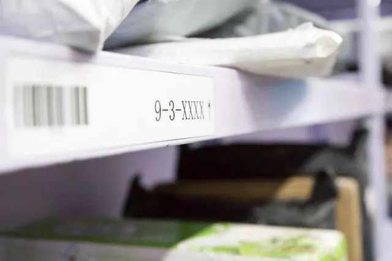
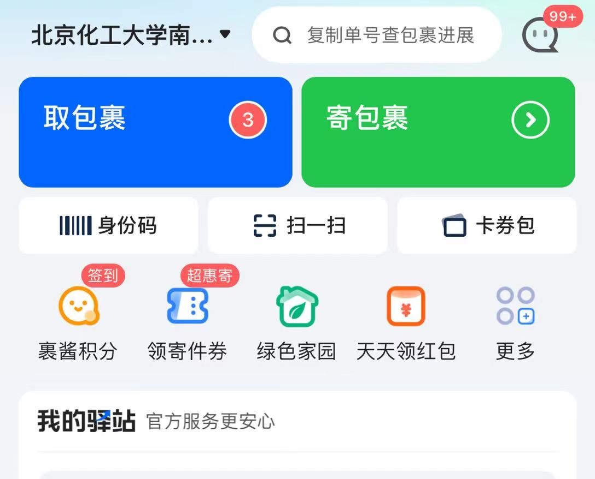

## 菜鸟驿站简介

地理位置：实验楼 A 座地下室

工作时间：上午8:00——晚上19:30

菜鸟驿站是昌平校区的最主要快递收发点，有申通、顺丰、中通、圆通、韵达、京东、EMS 等各大快递，其中顺丰和京东设有独立的服务区，其余快递由菜鸟驿站统一管理。

## 取包裹

当同学们收到取件提醒的短信时，就代表快递已经到达菜鸟驿站了。同学们可以选择自行前往驿站取件或由无人车配送到寝室楼下。

### 驿站自取
1、打开菜鸟裹裹APP，查看取件码（京东、顺丰取件码只能通过手机短信查看）。取件码由三个部分组成，第一个代表货架号，第二个代表货架层号，第三个代表包裹序号。每个包裹都有对应的取件码，同学们需要根据取件码找到对应的货架，就能找到自己的包裹。可能取件码会重复，注意查看到货时间（包裹的单子上会写）是否与信息一致。

2、扫身份码出站。从菜鸟驿站取走的包裹，都需要在入口的机器处扫描身份码登记出站（京东、顺丰无需扫身份码），成功扫码后会提示“出站成功，请取走你的包裹”。

### 无人车配送

菜鸟驿站配备了若干个无人配送车，当同学们不想去驿站取快递时可以预约无人车送到宿舍楼下。同学们需要在菜鸟裹裹平台上自行选择配送的快递和配送的时间段，无人车会准时到达宿舍楼下，停稳后会打电话提醒取件。（顺丰、京东快递无法配送）

收费标准：天猫、淘宝下单的商品不收配送费，其余快递按大小收费，一件的价格区间为2——4元，特大件无法配送。

## 小推车租赁

菜鸟驿站服务台处有两个公共小推车，当同学们在驿站自取快递拿不起时可以租用小推车。使用小推车无需租赁费，但要支付100元押金。同学们只要登记身份信息，扫码支付100元押金就可以成功拉走小推车啦！

用完小推车后要记得在规定时间前归还给驿站，工作人员会退还押金，超时可是要收取额外费用的哦！

## 旧纸箱回收

菜鸟驿站入口处设置了一个快递包装回收点，同时提供了拆快递盒的小刀，同学们可以选择在驿站内拆掉快递，把快递纸箱留在驿站回收，这样不仅能够避免宿舍堆积纸箱，也能助力环保工作。

## 寄包裹

驿站除了取快递，还可以帮我们寄快递，在菜鸟裹裹中预约寄件，带着要寄的物品到服务台报上手机号码就可以了，免费包装完后，工作人员们就会以最快速度帮我们寄出去。

## 多多买菜自提点

菜鸟驿站不仅是快递寄存点，还是新鲜蔬果自提点。2022上半年菜鸟驿站加盟成为了多多买菜的自提点，同学们可以在拼多多APP的多多买菜平台中购买自己想要的东西，次日就可以到驿站自提。

自提点地址：北京化工大学地下车库菜鸟驿站

需要注意的是，自提商品没有取件码，都摆放在集中的两个货架上，需要同学们自行寻找。