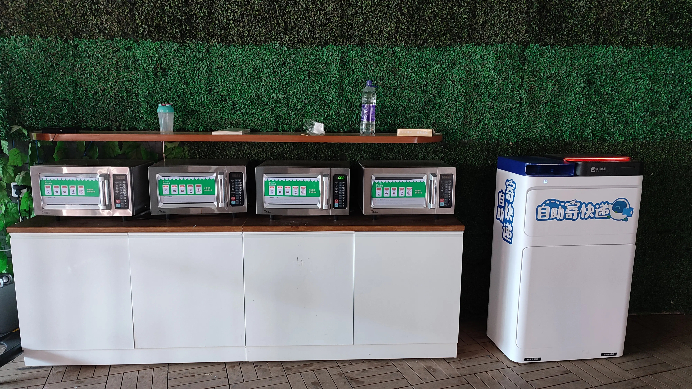
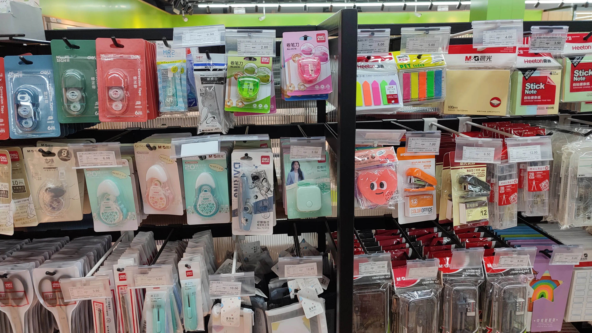
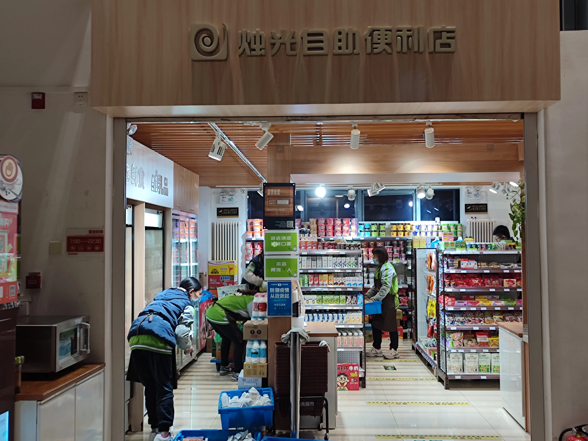
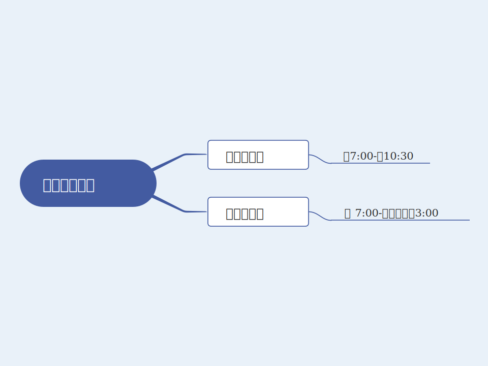

2021年秋季期，我们学校有了新的超市——麦叔的铺子。超市是同学们日常生活中必不可少的，生活用品、学习用品、零食等大多都是从超市购买的，超市的服务质量影响着同学们的购物体验。接下来看看麦叔的铺子给同学们提供的优质服务吧！

## 超市休闲区

麦叔的铺子在超市的门口摆放了一些桌椅，同学们购买食物之后可以在此区域就餐。

麦叔的铺子为同学们提供了一个良好的就餐环境。同时为了保证超市周边保持卫生，防止细菌污染，超市外面未设垃圾桶。所以，同学们要将自己的垃圾带走扔到垃圾桶，做文明大学生。

## 食品加热

超市门口右边是食品加热区，加热区有四台大功率微波炉，同学们在超市买了需要加热的食品后可直接加热。在墙壁上贴有关于微波炉的使用规则及注意事项，同学们记得别加热太久，否则食物会变糊。

## 充电宝

相信同学们在主教楼上课之时一定遇到过手机没电的尴尬场景，这个时候如果急需用手机的话同学们可以去超市的收银台租充电宝，只需要扫一扫二维码，就可以轻松借到一个满电量的充电宝了!

## 超市环境区

麦叔的铺子入驻后，对超市进行了简单装修。经过装修，超市更加漂亮了，商品摆放整齐，超市内的卫生条件也保持的很好，并且新增了售卖水果捞和烤肠的区域。

## 超市商品

学校超市里的商品种类齐全，同学们平时能用到的货物超市基本上都有。

同学们学习会用到的工具，比如剪刀、便签、便利贴、订书机、计算器等在超市均有售卖。

在学习中需要的作业纸，不同专业需要的实验报告纸，课程设计纸等都这整齐的摆放在货架上。

## 超市冷藏区

*注：蛋糕甜点*

*注：中晚餐盒饭*

*注：汉堡三明治*

*注：应季新鲜水果*

*注：奶制品*

超市的冷藏区算是一大特色，在冷藏区里摆放着许多的商品。同学们平时课程比较多，没有时间吃饭的时候，可以选择冷藏区里的盒饭或者汉堡等。盒饭可口美味，汉堡香美诱人。货架上还有甜点和水果，味道也很不错。

超市还推出了水果捞，水果配上香甜的酸奶又是一种享受，同学们在教学楼就能买到鲜美的水果捞。

## 宿舍超市

在学生公寓的一号楼、二号楼、七号楼一楼里都有一个小超市，里面的商品不多，但是基本能满足同学们的需求。如果宿舍超市没有需要的商品，同学们可以到主教的大超市进行购买。

## 超市营业时间

*注：截止到目前，教学楼超市营业时间为早上7:00至第二天3:00，宿舍楼超市营业时间为早上7:00-晚上22:30，若有调整，以实际的营业时间为准*

