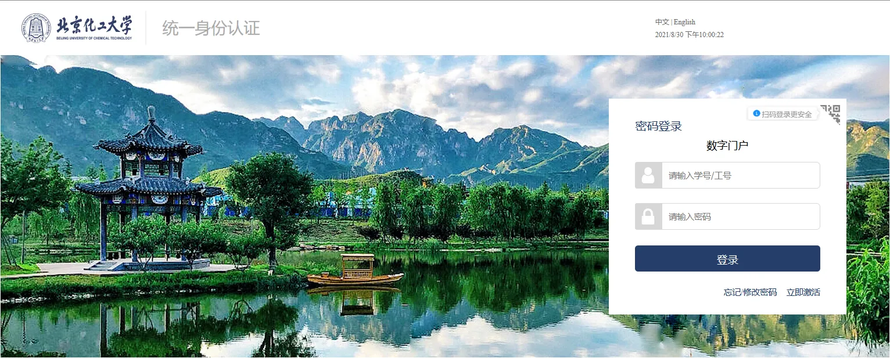
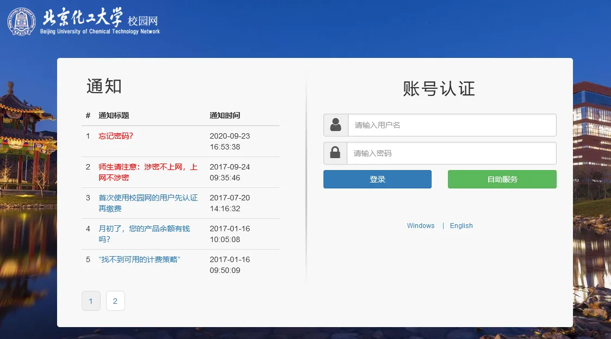
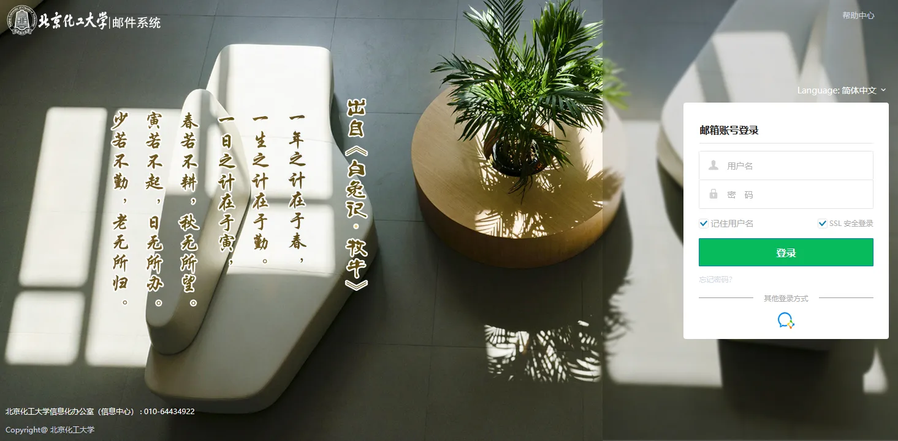
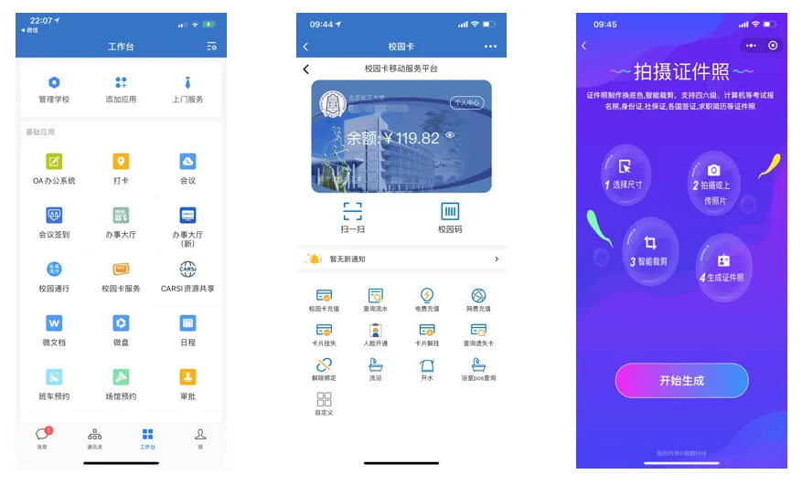

大一的新同学们，大家好！为大家介绍学校的主要信息化服务。

## 统一身份认证平台

功能：统一身份认证平台是服务于全校师生的信息化基础平台，为学校多种应用系统（包括网络准入认证系统、数字北化、教务管理系统、研究生管理系统等）提供统一的账号管理和身份认证服务，满足师生一套密码、全校漫游的需求。

网址：http://my.buct.edu.cn。
>账户激活：首次使用用户须进行激活，点击登录页面“立即激活”，账号为学/工号.  
修改密码：点击登录页面“忘记/修改密码”功能进行修改。

## 校园网

>无线网：校园主要区域提供BUCT Wi-Fi信号，在教学楼和图书馆区域还提供BUCT-JX、JiaoXue Wi-Fi信号，连接后须等待网关认证页面自动弹出进行认证（初次登录须等待1分钟左右）.  
有线网：每间宿舍提供两个有线信息插座，可实现有线网接入。  

计费策略：学生每月10GB免费流量，超出1元/GB，超出20GB后2元/GB，IPv6流量不计费；BUCT-JX无线网认证后访问互联网资源不计费，使用JiaoXue接入校园网只可访问校内资源。

网址：http://tree.buct.edu.cn。

用户名、密码：同统一身份认证平台。

测速网：http://speedtest.buct.edu.cn，可测量所在接入位置到信息中心的网速。

## 电子邮件服务

网址：http://mail.buct.edu.cn。

用户名：学号，初始密码：buct@身份证后6位（例如，某新生学号为2021000001，身份证后6位为111111，则邮箱系统用户名为2021000001@buct.edu.cn，密码为buct@111111）。

邮件别名：可自行设置一个以英文字母为地址的邮件名称，在个人设置中修改。

提示：电子邮件未接入统一身份认证平台，确保忘记统一身份密码后可通过邮件找回。

## 数字北化

功能：校内信息服务和常用信息系统入口。

网址：https://i.buct.edu.cn。

用户名、密码：同统一身份认证平台。

## 北京化工大学官网

网址：http://news.buct.edu.cn/

主要用途

了解学校重大资讯、专题故事，关于北化的时讯可以在这里找到！还可以链接到几乎所有学校部处、二级学院的官方网站！

## 企业微信

功能：企业微信APP是学校的移动数字校园门户，人员信息已实现每日从数据中心自动同步。学校的企业微信已集成80余个应用，包括自助采集人脸照片、数字迎新、办事大厅、校园卡服务等信息系统，可实现自动建立“班级群”、创建内部临时群、开启“直播”教学、召开“语音或视频会议”、推送部门新闻通告等功能。

数字迎新：新生通过企业微信APP-数字迎新应用进行网上预报到。该应用可查询新生所在班级、辅导员、学长、宿舍等信息，可拍摄并上传个人证件照片（用于制作校园卡和现场报到身份验证）。

## 校园卡

功能：校园卡可用于注册、借书、门禁、就医、就餐、超市购物、洗澡、上网缴费等，通过学校企业微信APP的校园卡服务可完成线上充值、查询流水、挂失等功能。

>初始密码：身份证后六位（若最后一位为X，用数字1代替）。  
充值方式：企业微信-校园卡服务、支付宝、圈存机（绑定银行卡转账）。

>圈钱机位置：   
北区：樱花苑各楼一层、图书馆一层一站式服务大厅、第一教学楼B座、紫竹餐厅第二食堂；  
东区：教学楼、行政楼一层、图书馆外地下一层信息中心服务大厅、第四食堂。 

补卡方式：补卡机自助补卡和人工补卡

>自助补卡机位置：   
北区：图书馆一层一站式服务大厅、第一教学楼（B阶）一层大厅、4号楼北厅;  
东区：图书馆一层大厅；图书馆外地下一层信息中心服务大厅。

>人工补卡地点：  
北区：图书馆一层一站式服务大厅；  
东区：图书馆外地下一层信息中心服务大厅。

## 正版化软件平台

功能：可下载、安装、激活软件，如Windows、Office、WPS、思维导图等。

网址：http://software.buct.edu.cn。

用户名、密码：同统一身份认证平台。

## 信息中心服务大厅位置及联系方式

>东校区：图书馆外地下一层信息中心服务大厅，电话：64435227、64436226.  
北校区：图书馆一层一站式服务大厅，电话：80105686、80191165、80191167。  
信息中心网站：http://cit.buct.edu.cn。  
电子邮件地址：center@mail.buct.edu.cn。  
企业微信：通讯录-员工服务。

*注：部分图文引用北京化工大学信息化办公室*

 
