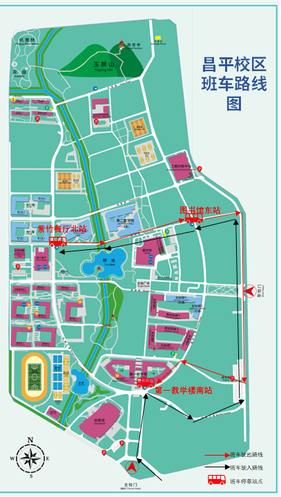
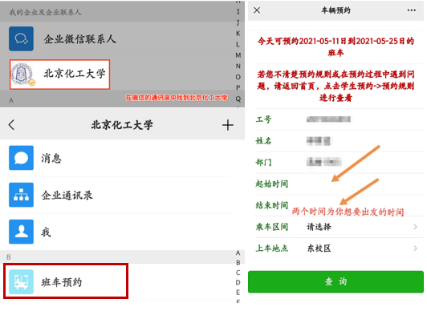

## 班车预约服务
北京化工大学后勤服务集团提供了班车服务以方便师生往返学校东区和昌平校区。  

## 校车时刻表（仅供参考，请以文末链接提供时间为准）

## 停靠站点

## 班车路线图

 
## 班车预约入口

  

## 规则说明
1.预约时间范围:当日班车及未来14天内班车，班车发车前1小时停止预约该趟班车。  

2.每天16:00到17:00为系统调整时间，由系统管理员进行派车安排，此段时间内暂停预约，20:00学生端预约系统继续开放预约次日班车。  

3.16:00之前预约次日及以后班车，每趟班车有20个名额限制，16:00之后系统管理员依据剩余座位数增加预约名额。  

4.周六日的班车必须在周五16:00之前预约，16:00之后将不再开放预约。  

5.用户预约查询时只会查询出可预约的班车信息，选择班车后完成支付。支付方式分为线上支付和线下支付两种。线上支付通过微信支付乘车费用，须在5分钟之内完成支付，线下支付在乘车时刷校园卡完成支付。  

6.发车前八小时内解约以及预约未解约未乘坐均视为违约行为，当月违约行为超过三次，将取消当月预约资格，下个月自动恢复。  

## 温馨提示

1.班车发车前1小时停止预约该趟班车，但可在上车点等候，若车有空座可以现场买票上车。  

2.用户预约查询时只会查询出可预约的班车信息，选择班车后须在5分钟之内完成支付，微信支付即可。  

3.预约成功后会在微信端发放电子车票，凭编号上车。线下支付的同学要在上车点刷校园卡，有工作人员拿刷卡机等待。  

## 信息来源
更多班车安排相关信息，请访问班车官方信息发布网站：https://www.buct.edu.cn/bc/list.htm  

其他疑问，可以电询后勤服务集团，联系人：张队长，电话：64434342、13801105910  

（班车网页信息来自班车官网，联系方式来自微信班车班车预约功能，本文仅供参考，详细信息请参照企业微信班车预约应用以及学校官网）

