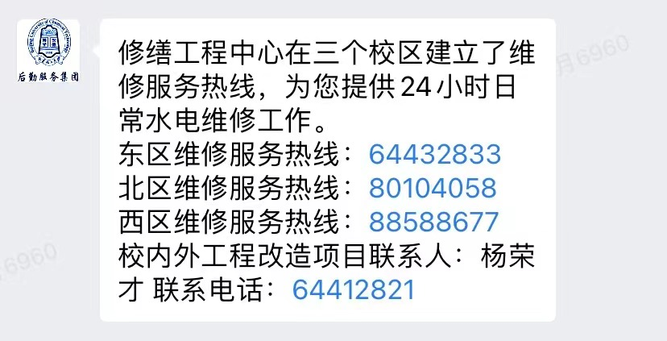
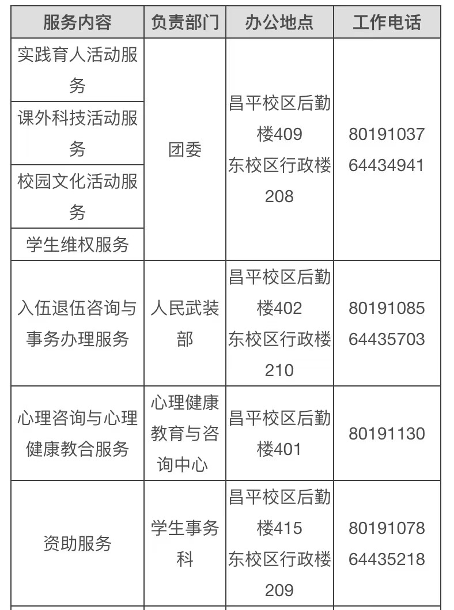

## 党群机构

党群机构包括：党委办公室，党委组织部，党委宣传部，党委统战部，纪委办公室（监察处，党委巡察工作办公室）党委教师工作部，学生工作办公室，研究生工作部，保卫处，工会，团委。

## 行政机构

行政机构包括：校长办公室，审计处，人事处，人才引进办公室，财务处，教务处，招生办公室，研究生院，科学技术发展研究院，先进技术与装备研究院，规划与学科建设办公室，国有资产与实验室安全管理处，基建处，离退休人员工作处，国际交流与合作处，大学科学园管委会，国内合作交流处，高新技术研究院，西校区管理办公室，北区工作办公室，高新区建设指挥部，采购与招标办公室，后勤保障部。

## 直属单位

直属单位包括：教师发展中心，信息化办公室，北京北化大投资有限公司，图书馆，后勤服务集团，服务中心。

## 企业微信部分功能简介

在了解学校组织机构设置基础上，我们来了解一下企业微信及其相关功能。

## 基础应用

基础应用这部分基本能满足我们日常所需，如校园卡充值，班车预约等等，如果同学们遇到一些日常生活学习上的事情，可以先从这部分查找。下面具体介绍几个比较常用的。

1.办事大厅：办事大厅包括IT服务，教学服务，生活服务，资产服务，外事服务，科学研究，党群服务，其他服务八个板块。其中的热门服务如下：

2.校园卡服务：在这个板块可以进行校园卡充值，电费充值，网费充值，卡片挂失等操作。

3.校园通行：校园通行包括三个内容：通行申请，通行审核，通行码。通行申请里分为教师申请，学生申请，夜间申请，出差申请，电动车证申请。通行审核里分为教师审核，学生通行审核，车辆通行待审核，车辆通行已审核，教师已审核。通行码里分为开学返校码，教师通行用码，学生通行用码。

## 二级单位

二级单位这部分内容比较多，平时使用的模块并不多，大家如果在基础应用里问题没有得到解决，可到这部分来查找相关单位解决问题。

1.北区办：在这里可以查询校区电话，校区制度，校区地图，校区交通，线上展区等内容，还可以进行意见反馈。

2.后勤集团:在这里可以查询相关部门的电话。

3.学工办：在这里可以查看校历和校园一站常用服务；进行心理，学业，职业，军旅，资助咨询；还可以提反馈建议。

## 小程序

小程序这部分与微信中的小程序功能一致，此处不做赘述。
