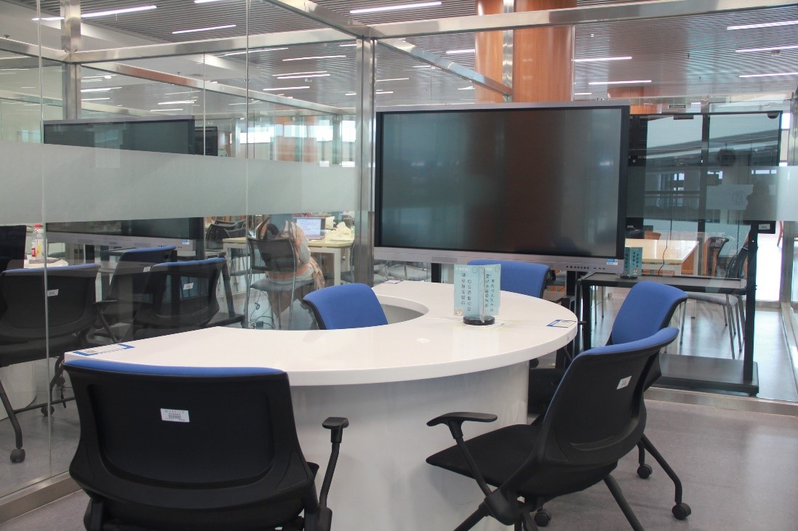
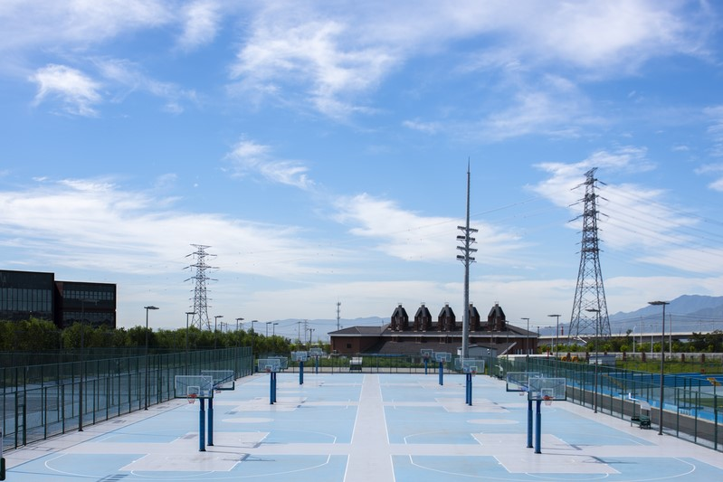

## 图书馆研讨室

  
地点：图书馆三层和四层

开放时间：8:00-22:00

研讨室预约流程：

>① 打开企业微信中“图书馆”应用。  
② 在图书馆“最新动态”下打开“研修间预约”。  
③ 登录预约系统：账号为自己的学号，密码为空。  
④ 选择房间：选择自己所需的房间类型和预约时间，点击预约。  
⑤ 添加成员：添加研讨的成员，直接搜索名字，核对学号。  
⑥ 注意：2人间，使用人数为2人，添加人数为1人；6人间，使用人数下限为3人，上限为6人。  
⑦ 使用：在预约时间点的10分钟前后，使用预约人员的校园卡刷开研讨室的门即可使用。  

预约规则：

> a)	学生可以预约3天内的部分房间，每次最长4个小时。  
b)	使用人需要依次在预约时间点前后10分钟内刷卡进入，否则门将无法开启，须联系管理员开启房间，同时申请人被记录违规一次。  
c)	房间使用结束时，需要在系统上签退，并需恢复房间布局，检查关闭设备。  
d)	遵守研讨室的管理制度，遇到问题及时上报流通阅览部服务台，拨打80191227（三层），80191198（四层）。  

## 室外体育场馆
### 篮球场地（宿舍楼南侧）

预约情况：无需预约。

地点：宿舍楼南侧。

开放时间：24小时开放。

### 篮球场地（紫竹苑东侧）
 
【图片】

预约情况：无需预约。

地点：紫竹苑东侧。

开放时间：24小时开放。

### 足球场地（宿舍楼南侧）

预约情况：无需预约。

地点：宿舍楼南侧。

开放时间：24小时开放。

### 网球场地

[图片]

预约情况：需要预约。

地点：宿舍楼南侧和紫竹苑东侧。

开放时间：16:00-22:00。

预约方式：

>① 打开企业微信。  
② 打开工作台中“场馆预约”应用。  
③ 选择功能栏中“预约”。  
④ 打开页面后，选择你需要预约的时间段和场地，点击预约。  
⑤ 预约成功后，使用微信付款即可。  

## 室内体育场馆

体育馆简介:
 
北京化工大学体育馆占地:49414㎡ 建筑面积:23000㎡ 地上四层，整体建筑高度:23.95m 局部:25.95m。

体育馆位于新校区校园南侧主入口轴线以西地块，建筑呈西南-东北走向，主体量由四条弧线定义而成，与校园内道路及空间走势相协调。长轴方向约150米，短轴方向约84米。体育馆与北侧的第一教学楼、东侧未来的学科交叉中心共同构成校园主入口的建筑群体形象。建筑从西南到东北分别由训练馆、可容纳4000人的球类比赛馆和游泳馆三部分组成。

1.主要功能:

主场馆:主要用来举办大型比赛或用作某些活动的场地。

训练馆:给同学们平时的体育生活提供高质量的场地保障。其主要包括：健身房,羽毛球场,网球场,乒乓球台,排球场。
这些场地由同学们在网上进行相应使用时间段的预约,并进行缴费后方可使用。

2.预约

收费标准：

预约方式：

>① 打开企业微信。  
② 打开工作台中“场馆预约”应用。  
③ 选择功能栏中“预约”。  
④ 打开页面后，选择你需要预约的时间段和场地，点击预约。  
⑤ 预约成功后，使用微信付款即可。  

预约规则：

>在校师生均通过企业微信中场馆预约系统进行线上预约和支付，不接受现金支付。如取消预约，在预约使用时间的前一天24:00之前取消会全额退还预约费用，否则预约费用将不再退还。